[Основные Токены](https://github.com/CatacombNoop/ktms-tokens/blob/main/images_main/README.md) |
[Основные Токены 2](https://github.com/CatacombNoop/ktms-tokens/blob/main/images_main2/README.md) |
[Мудроградовки](https://github.com/CatacombNoop/ktms-tokens/blob/main/images_mudrog/README.md) |
[Иконки](https://github.com/CatacombNoop/ktms-tokens/blob/main/images_icons/README.md) |
[Иконки Доп.](https://github.com/CatacombNoop/ktms-tokens/blob/main/images_icons2/README.md) |
[Эффекты](https://github.com/CatacombNoop/ktms-tokens/blob/main/images_sfx/README.md) |
[Токены Марка](https://github.com/CatacombNoop/ktms-tokens/blob/main/images_mark/README.md) |
[Одиум](https://github.com/CatacombNoop/ktms-tokens/blob/main/images_odium/README.md) |
[Карты](https://github.com/CatacombNoop/ktms-tokens/blob/main/images_maps/README.md) |
[**Вики**](https://github.com/CatacombNoop/ktms-tokens/wiki) |
<table><tr>
<tr>
<td valign="bottom">
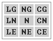 
0.png
</td>

<td valign="bottom">
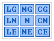 
AA.png
</td>

<td valign="bottom">
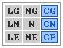 
AC.png
</td>

<td valign="bottom">
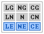 
AE.png
</td>

<td valign="bottom">
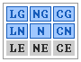 
AG-AN.png
</td>

<td valign="bottom">
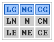 
AG.png
</td>

</tr>
<tr>
<td valign="bottom">
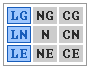 
AL.png
</td>

<td valign="bottom">
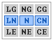 
AN.png
</td>

<td valign="bottom">
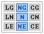 
AN1.png
</td>

<td valign="bottom">
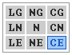 
CE.png
</td>

<td valign="bottom">
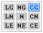 
CG.png
</td>

<td valign="bottom">
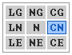 
CN.png
</td>

</tr>
<tr>
<td valign="bottom">
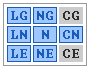 
Fire.png
</td>

<td valign="bottom">
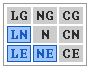 
LD-C.png
</td>

<td valign="bottom">
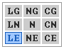 
LE.png
</td>

<td valign="bottom">
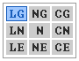 
LG.png
</td>

<td valign="bottom">
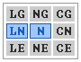 
LN-N.png
</td>

<td valign="bottom">
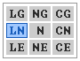 
LN.png
</td>

</tr>
<tr>
<td valign="bottom">
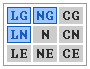 
LU-C.png
</td>

<td valign="bottom">
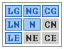 
Mystra.png
</td>

<td valign="bottom">
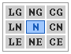 
N.png
</td>

<td valign="bottom">
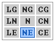 
NE.png
</td>

<td valign="bottom">
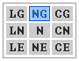 
NG.png
</td>

<td valign="bottom">
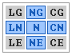 
NN.png
</td>

</tr>
<tr>
<td valign="bottom">
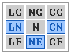 
Orc.png
</td>

<td valign="bottom">
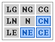 
RD-C.png
</td>

<td valign="bottom">
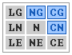 
RU-C.png
</td>

<td valign="bottom">
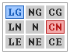 
ShenLi.png
</td>

</tr></table>