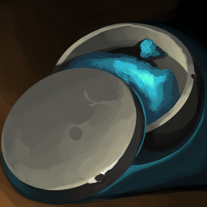

[Основные Токены](https://github.com/CatacombNoop/ktms-tokens/blob/main/images_main/README.md) |
[Основные Токены 2](https://github.com/CatacombNoop/ktms-tokens/blob/main/images_main2/README.md) |
[Мудроградовки](https://github.com/CatacombNoop/ktms-tokens/blob/main/images_mudrog/README.md) |
[Иконки](https://github.com/CatacombNoop/ktms-tokens/blob/main/images_icons/README.md) |
[Иконки Доп.](https://github.com/CatacombNoop/ktms-tokens/blob/main/images_icons2/README.md) |
[Эффекты](https://github.com/CatacombNoop/ktms-tokens/blob/main/images_sfx/README.md) |
[Токены Марка](https://github.com/CatacombNoop/ktms-tokens/blob/main/images_mark/README.md) |
[Одиум](https://github.com/CatacombNoop/ktms-tokens/blob/main/images_odium/README.md) |
[Карты](https://github.com/CatacombNoop/ktms-tokens/blob/main/images_maps/README.md) |
[**Вики**](https://github.com/CatacombNoop/ktms-tokens/wiki) |
<table><tr>
<tr>
<td valign="bottom">
 
.icon.png
</td>

<td valign="bottom">
 
Air.png
</td>

<td valign="bottom">
 
air_b_01.png
</td>

<td valign="bottom">
 
bane.png
</td>

<td valign="bottom">
 
bestow-curse.png
</td>

<td valign="bottom">
 
book_b_01.png
</td>

</tr>
<tr>
<td valign="bottom">
 
book_b_03.png
</td>

<td valign="bottom">
 
bottlel_b_01.png
</td>

<td valign="bottom">
 
bronze_flask.png
</td>

<td valign="bottom">
 
br_sword.png
</td>

<td valign="bottom">
 
b_04.png
</td>

<td valign="bottom">
 
b_08.png
</td>

</tr>
<tr>
<td valign="bottom">
 
b_09.png
</td>

<td valign="bottom">
 
call-lightning.png
</td>

<td valign="bottom">
 
Chaos.png
</td>

<td valign="bottom">
 
Chaos2.png
</td>

<td valign="bottom">
 
chest_b_02.png
</td>

<td valign="bottom">
 
chest_b_03.png
</td>

</tr>
<tr>
<td valign="bottom">
 
chest_b_04.png
</td>

<td valign="bottom">
 
chromatic-orb.png
</td>

<td valign="bottom">
 
coins_b_03.png
</td>

<td valign="bottom">
 
conjure-barrage.png
</td>

<td valign="bottom">
 
dice_b_01.png
</td>

<td valign="bottom">
 
duel.png
</td>

</tr>
<tr>
<td valign="bottom">
 
earring_b_01.png
</td>

<td valign="bottom">
 
earthh.png
</td>

<td valign="bottom">
 
earth_b_01.png
</td>

<td valign="bottom">
 
eldritch-blast.png
</td>

<td valign="bottom">
 
enchantment.png
</td>

<td valign="bottom">
 
feather_b_06.png
</td>

</tr>
<tr>
<td valign="bottom">
 
fire-bolt.png
</td>

<td valign="bottom">
 
fire_b_01.png
</td>

<td valign="bottom">
 
guidance.png
</td>

<td valign="bottom">
 
GUN.png
</td>

<td valign="bottom">
 
identify.png
</td>

<td valign="bottom">
 
letters_b_01.png
</td>

</tr>
<tr>
<td valign="bottom">
 
lightning-arrow.png
</td>

<td valign="bottom">
 
magic-circle.png
</td>

<td valign="bottom">
 
map_b_01.png
</td>

<td valign="bottom">
 
mh_b_01.png
</td>

<td valign="bottom">
 
necromancy.png
</td>

<td valign="bottom">
 
necromancy2.png
</td>

</tr>
<tr>
<td valign="bottom">
 
necromancy3.png
</td>

<td valign="bottom">
 
necromancy_load.png
</td>

<td valign="bottom">
 
nondetection.png
</td>

<td valign="bottom">
 
Order.png
</td>

<td valign="bottom">
 
Order2.png
</td>

<td valign="bottom">
 
Order_Blood.png
</td>

</tr>
<tr>
<td valign="bottom">
 
Order_Blood2.png
</td>

<td valign="bottom">
 
Order_Blood3.png
</td>

<td valign="bottom">
 
Order_Blood4.png
</td>

<td valign="bottom">
 
Order_Magik.png
</td>

<td valign="bottom">
 
Order_moon.png
</td>

<td valign="bottom">
 
Order_Paganism.png
</td>

</tr>
<tr>
<td valign="bottom">
 
Order_Vicaria.png
</td>

<td valign="bottom">
 
powder_b_01.png
</td>

<td valign="bottom">
 
pr-from-energy.png
</td>

<td valign="bottom">
 
preview (10).png
</td>

<td valign="bottom">
 
preview (100).png
</td>

<td valign="bottom">
 
preview (101).png
</td>

</tr>
<tr>
<td valign="bottom">
 
preview (102).png
</td>

<td valign="bottom">
 
preview (102)2.png
</td>

<td valign="bottom">
 
preview (103).png
</td>

<td valign="bottom">
 
preview (104).png
</td>

<td valign="bottom">
 
preview (105).png
</td>

<td valign="bottom">
 
preview (106).png
</td>

</tr>
<tr>
<td valign="bottom">
 
preview (107).png
</td>

<td valign="bottom">
 
preview (108).png
</td>

<td valign="bottom">
 
preview (109).png
</td>

<td valign="bottom">
 
preview (11).png
</td>

<td valign="bottom">
 
preview (110).png
</td>

<td valign="bottom">
 
preview (111).png
</td>

</tr>
<tr>
<td valign="bottom">
 
preview (112).png
</td>

<td valign="bottom">
 
preview (113).png
</td>

<td valign="bottom">
 
preview (114).png
</td>

<td valign="bottom">
 
preview (115).png
</td>

<td valign="bottom">
 
preview (116).png
</td>

<td valign="bottom">
 
preview (117).png
</td>

</tr>
<tr>
<td valign="bottom">
 
preview (118).png
</td>

<td valign="bottom">
 
preview (119).png
</td>

<td valign="bottom">
 
preview (12).png
</td>

<td valign="bottom">
 
preview (120).png
</td>

<td valign="bottom">
 
preview (121).png
</td>

<td valign="bottom">
 
preview (122).png
</td>

</tr>
<tr>
<td valign="bottom">
 
preview (123).png
</td>

<td valign="bottom">
 
preview (124).png
</td>

<td valign="bottom">
 
preview (125).png
</td>

<td valign="bottom">
 
preview (126).png
</td>

<td valign="bottom">
 
preview (127).png
</td>

<td valign="bottom">
 
preview (128).png
</td>

</tr>
<tr>
<td valign="bottom">
 
preview (129).png
</td>

<td valign="bottom">
 
preview (13).png
</td>

<td valign="bottom">
 
preview (130).png
</td>

<td valign="bottom">
 
preview (131).png
</td>

<td valign="bottom">
 
preview (132).png
</td>

<td valign="bottom">
 
preview (133).png
</td>

</tr>
<tr>
<td valign="bottom">
 
preview (134).png
</td>

<td valign="bottom">
 
preview (135).png
</td>

<td valign="bottom">
 
preview (136).png
</td>

<td valign="bottom">
 
preview (137).png
</td>

<td valign="bottom">
 
preview (138).png
</td>

<td valign="bottom">
 
preview (139).png
</td>

</tr>
<tr>
<td valign="bottom">
 
preview (14).png
</td>

<td valign="bottom">
 
preview (140).png
</td>

<td valign="bottom">
 
preview (15).png
</td>

<td valign="bottom">
 
preview (16).png
</td>

<td valign="bottom">
 
preview (17).png
</td>

<td valign="bottom">
 
preview (18).png
</td>

</tr>
<tr>
<td valign="bottom">
 
preview (19).png
</td>

<td valign="bottom">
 
preview (2).png
</td>

<td valign="bottom">
 
preview (20).png
</td>

<td valign="bottom">
 
preview (21).png
</td>

<td valign="bottom">
 
preview (22).png
</td>

<td valign="bottom">
 
preview (23).png
</td>

</tr>
<tr>
<td valign="bottom">
 
preview (24).png
</td>

<td valign="bottom">
 
preview (25).png
</td>

<td valign="bottom">
 
preview (26).png
</td>

<td valign="bottom">
 
preview (27).png
</td>

<td valign="bottom">
 
preview (28).png
</td>

<td valign="bottom">
 
preview (29).png
</td>

</tr>
<tr>
<td valign="bottom">
 
preview (3).png
</td>

<td valign="bottom">
 
preview (30).png
</td>

<td valign="bottom">
 
preview (31).png
</td>

<td valign="bottom">
 
preview (32).png
</td>

<td valign="bottom">
 
preview (33).png
</td>

<td valign="bottom">
 
preview (34).png
</td>

</tr>
<tr>
<td valign="bottom">
 
preview (35).png
</td>

<td valign="bottom">
 
preview (36).png
</td>

<td valign="bottom">
 
preview (37).png
</td>

<td valign="bottom">
 
preview (38).png
</td>

<td valign="bottom">
 
preview (39).png
</td>

<td valign="bottom">
 
preview (4).png
</td>

</tr>
<tr>
<td valign="bottom">
 
preview (40).png
</td>

<td valign="bottom">
 
preview (41).png
</td>

<td valign="bottom">
 
preview (42).png
</td>

<td valign="bottom">
 
preview (43).png
</td>

<td valign="bottom">
 
preview (44).png
</td>

<td valign="bottom">
 
preview (45).png
</td>

</tr>
<tr>
<td valign="bottom">
 
preview (46).png
</td>

<td valign="bottom">
 
preview (47).png
</td>

<td valign="bottom">
 
preview (48).png
</td>

<td valign="bottom">
 
preview (49).png
</td>

<td valign="bottom">
 
preview (5).png
</td>

<td valign="bottom">
 
preview (50).png
</td>

</tr>
<tr>
<td valign="bottom">
 
preview (51).png
</td>

<td valign="bottom">
 
preview (52).png
</td>

<td valign="bottom">
 
preview (53).png
</td>

<td valign="bottom">
 
preview (54).png
</td>

<td valign="bottom">
 
preview (55).png
</td>

<td valign="bottom">
 
preview (56).png
</td>

</tr>
<tr>
<td valign="bottom">
 
preview (57).png
</td>

<td valign="bottom">
 
preview (58).png
</td>

<td valign="bottom">
 
preview (59).png
</td>

<td valign="bottom">
 
preview (6).png
</td>

<td valign="bottom">
 
preview (60).png
</td>

<td valign="bottom">
 
preview (61).png
</td>

</tr>
<tr>
<td valign="bottom">
 
preview (62).png
</td>

<td valign="bottom">
 
preview (63).png
</td>

<td valign="bottom">
 
preview (64).png
</td>

<td valign="bottom">
 
preview (65).png
</td>

<td valign="bottom">
 
preview (66).png
</td>

<td valign="bottom">
 
preview (67).png
</td>

</tr>
<tr>
<td valign="bottom">
 
preview (68).png
</td>

<td valign="bottom">
 
preview (69).png
</td>

<td valign="bottom">
 
preview (7).png
</td>

<td valign="bottom">
 
preview (70).png
</td>

<td valign="bottom">
 
preview (71).png
</td>

<td valign="bottom">
 
preview (72).png
</td>

</tr>
<tr>
<td valign="bottom">
 
preview (73).png
</td>

<td valign="bottom">
 
preview (74).png
</td>

<td valign="bottom">
 
preview (75).png
</td>

<td valign="bottom">
 
preview (76).png
</td>

<td valign="bottom">
 
preview (77).png
</td>

<td valign="bottom">
 
preview (78).png
</td>

</tr>
<tr>
<td valign="bottom">
 
preview (79).png
</td>

<td valign="bottom">
 
preview (8).png
</td>

<td valign="bottom">
 
preview (80).png
</td>

<td valign="bottom">
 
preview (81).png
</td>

<td valign="bottom">
 
preview (82).png
</td>

<td valign="bottom">
 
preview (83).png
</td>

</tr>
<tr>
<td valign="bottom">
 
preview (84).png
</td>

<td valign="bottom">
 
preview (85).png
</td>

<td valign="bottom">
 
preview (86).png
</td>

<td valign="bottom">
 
preview (87).png
</td>

<td valign="bottom">
 
preview (88).png
</td>

<td valign="bottom">
 
preview (89).png
</td>

</tr>
<tr>
<td valign="bottom">
 
preview (9).png
</td>

<td valign="bottom">
 
preview (90).png
</td>

<td valign="bottom">
 
preview (91).png
</td>

<td valign="bottom">
 
preview (92).png
</td>

<td valign="bottom">
 
preview (93).png
</td>

<td valign="bottom">
 
preview (94).png
</td>

</tr>
<tr>
<td valign="bottom">
 
preview (95).png
</td>

<td valign="bottom">
 
preview (96).png
</td>

<td valign="bottom">
 
preview (97).png
</td>

<td valign="bottom">
 
preview (98).png
</td>

<td valign="bottom">
 
preview (99).png
</td>

<td valign="bottom">
 
preview.png
</td>

</tr>
<tr>
<td valign="bottom">
 
p_03.png
</td>

<td valign="bottom">
 
p_07.png
</td>

<td valign="bottom">
 
rc_b_01.png
</td>

<td valign="bottom">
 
rc_b_02.png
</td>

<td valign="bottom">
 
retreat.png
</td>

<td valign="bottom">
 
runestone_05.png
</td>

</tr>
<tr>
<td valign="bottom">
 
runestone_b_02.png
</td>

<td valign="bottom">
 
runestone_b_05.png
</td>

<td valign="bottom">
 
runestone_b_06.png
</td>

<td valign="bottom">
 
r_03.png
</td>

<td valign="bottom">
 
r_04.png
</td>

<td valign="bottom">
 
r_23.PNG
</td>

</tr>
<tr>
<td valign="bottom">
 
scroll_b_01.png
</td>

<td valign="bottom">
 
scroll_b_02.png
</td>

<td valign="bottom">
 
scroll_b_03.png
</td>

<td valign="bottom">
 
shard_b_01.png
</td>

<td valign="bottom">
 
shatter.png
</td>

<td valign="bottom">
 
sk_b_01.png
</td>

</tr>
<tr>
<td valign="bottom">
 
sk_b_02.png
</td>

<td valign="bottom">
 
Sword.png
</td>

<td valign="bottom">
 
thaumaturgy.png
</td>

<td valign="bottom">
 
thunderwave.png
</td>

<td valign="bottom">
 
water_b_01.png
</td>

<td valign="bottom">
 
_potion.png
</td>

</tr>
<tr>
<td valign="bottom">
 
_potion2.png
</td>

<td valign="bottom">
 
_potion3.png
</td>

</tr></table>