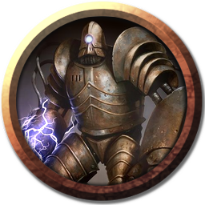
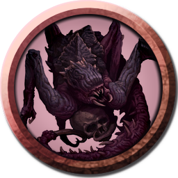
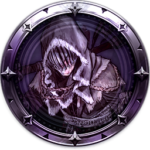
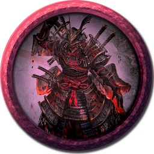
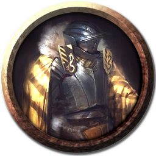
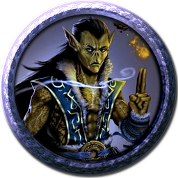
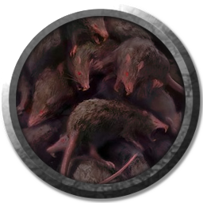
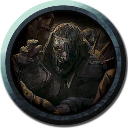

[Основные Токены](https://github.com/CatacombNoop/ktms-tokens/blob/main/images_main/README.md) |
[Основные Токены 2](https://github.com/CatacombNoop/ktms-tokens/blob/main/images_main2/README.md) |
[Мудроградовки](https://github.com/CatacombNoop/ktms-tokens/blob/main/images_mudrog/README.md) |
[Иконки](https://github.com/CatacombNoop/ktms-tokens/blob/main/images_icons/README.md) |
[Иконки Доп.](https://github.com/CatacombNoop/ktms-tokens/blob/main/images_icons2/README.md) |
[Эффекты](https://github.com/CatacombNoop/ktms-tokens/blob/main/images_sfx/README.md) |
[Токены Марка](https://github.com/CatacombNoop/ktms-tokens/blob/main/images_mark/README.md) |
[Одиум](https://github.com/CatacombNoop/ktms-tokens/blob/main/images_odium/README.md) |
[Карты](https://github.com/CatacombNoop/ktms-tokens/blob/main/images_maps/README.md) |
[**Вики**](https://github.com/CatacombNoop/ktms-tokens/wiki) |
<table><tr>
<tr>
<td valign="bottom">
 
0Blight_Plate5.png
</td>

<td valign="bottom">
 
0Blight_Plate6.png
</td>

<td valign="bottom">
 
0bnko1.png
</td>

<td valign="bottom">
 
0GD_ALTEA.png
</td>

<td valign="bottom">
 
0GD_ARI.png
</td>

<td valign="bottom">
 
0GD_ARI2.png
</td>

</tr>
<tr>
<td valign="bottom">
 
0GD_ELEN.png
</td>

<td valign="bottom">
 
0GD_Empty0.png
</td>

<td valign="bottom">
 
0GD_Empty1.png
</td>

<td valign="bottom">
 
0GD_LT_ANGEL.png
</td>

<td valign="bottom">
 
0GD_PROTO.png
</td>

<td valign="bottom">
 
0GD_PROTO2.png
</td>

</tr>
<tr>
<td valign="bottom">
 
0GD_PROTO_ANG.png
</td>

<td valign="bottom">
 
0GD_ShenLi0.png
</td>

<td valign="bottom">
 
0GD_ShenLi1.png
</td>

<td valign="bottom">
 
0GD_ShenLi2.png
</td>

<td valign="bottom">
 
0GD_ShenLi3.png
</td>

<td valign="bottom">
 
0GD_SML0.png
</td>

</tr>
<tr>
<td valign="bottom">
 
0GD_SML1.png
</td>

<td valign="bottom">
 
0SM_0.png
</td>

<td valign="bottom">
 
0SM_1.png
</td>

<td valign="bottom">
 
0SM_2.png
</td>

<td valign="bottom">
 
0TP_DL0.png
</td>

<td valign="bottom">
 
0TP_DL1.png
</td>

</tr>
<tr>
<td valign="bottom">
 
0TP_DL2.png
</td>

<td valign="bottom">
 
0TP_DL3.png
</td>

<td valign="bottom">
 
0TP_DL4.png
</td>

<td valign="bottom">
 
0TP_DL5.png
</td>

<td valign="bottom">
 
0TP_DL5_0.png
</td>

<td valign="bottom">
 
0TP_DL6.png
</td>

</tr>
<tr>
<td valign="bottom">
 
0TP_Knight.png
</td>

<td valign="bottom">
 
aasmr.png
</td>

<td valign="bottom">
 
Abberant-Knight.png
</td>

<td valign="bottom">
 
Abberant-Knight2.png
</td>

<td valign="bottom">
 
Abel.png
</td>

<td valign="bottom">
 
Aberr0.png
</td>

</tr>
<tr>
<td valign="bottom">
 
Aberr1.png
</td>

<td valign="bottom">
 
Aberr2.png
</td>

<td valign="bottom">
 
Aberrant-Brute.png
</td>

<td valign="bottom">
 
Aberrant-Cleric.png
</td>

<td valign="bottom">
 
Aberrant-Mage.png
</td>

<td valign="bottom">
 
Aberrant-Monster-Echo.png
</td>

</tr>
<tr>
<td valign="bottom">
 
Aberrant-Monster.png
</td>

<td valign="bottom">
 
Aberrant-Monster2.png
</td>

<td valign="bottom">
 
Aberrant-Paladin.png
</td>

<td valign="bottom">
 
Aberrant-troll.png
</td>

<td valign="bottom">
 
Abmn.png
</td>

<td valign="bottom">
 
Abmn2.png
</td>

</tr>
<tr>
<td valign="bottom">
 
Abmn3.png
</td>

<td valign="bottom">
 
Abmn4.png
</td>

<td valign="bottom">
 
Abmn5.png
</td>

<td valign="bottom">
 
ABMNX.png
</td>

<td valign="bottom">
 
ABR0.png
</td>

<td valign="bottom">
 
ABR1.png
</td>

</tr>
<tr>
<td valign="bottom">
 
ABR2.png
</td>

<td valign="bottom">
 
ABR3.png
</td>

<td valign="bottom">
 
Adamantine.png
</td>

<td valign="bottom">
 
Air_El.png
</td>

<td valign="bottom">
 
ALB.png
</td>

<td valign="bottom">
 
Alex.png
</td>

</tr>
<tr>
<td valign="bottom">
 
ALEX4.png
</td>

<td valign="bottom">
 
ALEXEY.png
</td>

<td valign="bottom">
 
Allian.png
</td>

<td valign="bottom">
 
ANG0.png
</td>

<td valign="bottom">
 
ANG1.png
</td>

<td valign="bottom">
 
ANG2.png
</td>

</tr>
<tr>
<td valign="bottom">
 
ANG3.png
</td>

<td valign="bottom">
 
ANG4.png
</td>

<td valign="bottom">
 
ANG5.png
</td>

<td valign="bottom">
 
ANG6.png
</td>

<td valign="bottom">
 
ANG7.png
</td>

<td valign="bottom">
 
ANG8.png
</td>

</tr>
<tr>
<td valign="bottom">
 
Angel.png
</td>

<td valign="bottom">
 
angel2.png
</td>

<td valign="bottom">
 
ANtimage.png
</td>

<td valign="bottom">
 
ANtimage2.png
</td>

<td valign="bottom">
 
ARB.png
</td>

<td valign="bottom">
 
ARCH.png
</td>

</tr>
<tr>
<td valign="bottom">
 
ARCH2.png
</td>

<td valign="bottom">
 
Archer.png
</td>

<td valign="bottom">
 
Archer1.png
</td>

<td valign="bottom">
 
Archer2.png
</td>

<td valign="bottom">
 
ARTEF.png
</td>

<td valign="bottom">
 
Assassin.png
</td>

</tr>
<tr>
<td valign="bottom">
 
AST.png
</td>

<td valign="bottom">
 
AST2.png
</td>

<td valign="bottom">
 
ASTARDD.png
</td>

<td valign="bottom">
 
ASTARDD2.png
</td>

<td valign="bottom">
 
ASTARD_RIGHT HAND.png
</td>

<td valign="bottom">
 
AST_PL_0.png
</td>

</tr>
<tr>
<td valign="bottom">
 
AST_PL_1.png
</td>

<td valign="bottom">
 
AST_PL_1N.png
</td>

<td valign="bottom">
 
AST_PL_1N2.png
</td>

<td valign="bottom">
 
AST_PL_1N3.png
</td>

<td valign="bottom">
 
AST_PL_1N4.png
</td>

<td valign="bottom">
 
AST_PL_2.png
</td>

</tr>
<tr>
<td valign="bottom">
 
AST_PL_3.png
</td>

<td valign="bottom">
 
AST_PL_4.png
</td>

<td valign="bottom">
 
AST_PL_5.png
</td>

<td valign="bottom">
 
AST_PL_6.png
</td>

<td valign="bottom">
 
AST_PL_6_2.png
</td>

<td valign="bottom">
 
AST_PL_7.png
</td>

</tr>
<tr>
<td valign="bottom">
 
Aurora.png
</td>

<td valign="bottom">
 
Aurora2.png
</td>

<td valign="bottom">
 
Aurora3.png
</td>

<td valign="bottom">
 
AURORA_N.png
</td>

<td valign="bottom">
 
AURORA_N_ECH.png
</td>

<td valign="bottom">
 
Band.png
</td>

</tr>
<tr>
<td valign="bottom">
 
Bandit.png
</td>

<td valign="bottom">
 
bandit2.png
</td>

<td valign="bottom">
 
bandit3.png
</td>

<td valign="bottom">
 
bandit4.png
</td>

<td valign="bottom">
 
bandit4_g.png
</td>

<td valign="bottom">
 
Banditt.png
</td>

</tr>
<tr>
<td valign="bottom">
 
bandiu.png
</td>

<td valign="bottom">
 
bard.png
</td>

<td valign="bottom">
 
BARD0.png
</td>

<td valign="bottom">
 
Bard2.png
</td>

<td valign="bottom">
 
BARD3.png
</td>

<td valign="bottom">
 
BARD`.png
</td>

</tr>
<tr>
<td valign="bottom">
 
behold.png
</td>

<td valign="bottom">
 
BES.png
</td>

<td valign="bottom">
 
Bes2.png
</td>

<td valign="bottom">
 
BIBER.png
</td>

<td valign="bottom">
 
BIG SHADOW.png
</td>

<td valign="bottom">
 
Bird.png
</td>

</tr>
<tr>
<td valign="bottom">
 
BloodHunter.png
</td>

<td valign="bottom">
 
BOAT.png
</td>

<td valign="bottom">
 
BOR.png
</td>

<td valign="bottom">
 
Borch.png
</td>

<td valign="bottom">
 
boss.png
</td>

<td valign="bottom">
 
boss2.png
</td>

</tr>
<tr>
<td valign="bottom">
 
BOYAN.png
</td>

<td valign="bottom">
 
BRAND.png
</td>

<td valign="bottom">
 
BRIG.png
</td>

<td valign="bottom">
 
BUR0.png
</td>

<td valign="bottom">
 
BUR1.png
</td>

<td valign="bottom">
 
Buuyuyro.png
</td>

</tr>
<tr>
<td valign="bottom">
 
BW_wind.png
</td>

<td valign="bottom">
 
Cartel0.png
</td>

<td valign="bottom">
 
caster.png
</td>

<td valign="bottom">
 
CAsterr.png
</td>

<td valign="bottom">
 
CAT.png
</td>

<td valign="bottom">
 
CAT2.png
</td>

</tr>
<tr>
<td valign="bottom">
 
CCGFg.png
</td>

<td valign="bottom">
 
CHANG.png
</td>

<td valign="bottom">
 
CHinnov.png
</td>

<td valign="bottom">
 
chocker.png
</td>

<td valign="bottom">
 
CLERIC.png
</td>

<td valign="bottom">
 
Cleric23 — копия.png
</td>

</tr>
<tr>
<td valign="bottom">
 
Cleric23.png
</td>

<td valign="bottom">
 
Con0.png
</td>

<td valign="bottom">
 
Con1.png
</td>

<td valign="bottom">
 
Con2.png
</td>

<td valign="bottom">
 
Con3.png
</td>

<td valign="bottom">
 
Con4.png
</td>

</tr>
<tr>
<td valign="bottom">
 
Con5.png
</td>

<td valign="bottom">
 
Contract.sai2
</td>

<td valign="bottom">
 
Core0.png
</td>

<td valign="bottom">
 
Core1.png
</td>

<td valign="bottom">
 
Core2.png
</td>

<td valign="bottom">
 
Core3.png
</td>

</tr>
<tr>
<td valign="bottom">
 
Core4.png
</td>

<td valign="bottom">
 
Core5.png
</td>

<td valign="bottom">
 
Core6.png
</td>

<td valign="bottom">
 
CORP.png
</td>

<td valign="bottom">
 
Crossbow.png
</td>

<td valign="bottom">
 
crossbow1.png
</td>

</tr>
<tr>
<td valign="bottom">
 
crossbow2.png
</td>

<td valign="bottom">
 
Crowd.png
</td>

<td valign="bottom">
 
Cult.png
</td>

<td valign="bottom">
 
DAmp.png
</td>

<td valign="bottom">
 
DAmp2.png
</td>

<td valign="bottom">
 
dark.png
</td>

</tr>
<tr>
<td valign="bottom">
 
dborn.png
</td>

<td valign="bottom">
 
Ddadad.png
</td>

<td valign="bottom">
 
DDRow2.png
</td>

<td valign="bottom">
 
DDRow3.png
</td>

<td valign="bottom">
 
deadaddss.png
</td>

<td valign="bottom">
 
Death.png
</td>

</tr>
<tr>
<td valign="bottom">
 
Death2.png
</td>

<td valign="bottom">
 
dedd.png
</td>

<td valign="bottom">
 
DEDDD.png
</td>

<td valign="bottom">
 
Deep-spw.png
</td>

<td valign="bottom">
 
Demon.png
</td>

<td valign="bottom">
 
DEMON_NKG.png
</td>

</tr>
<tr>
<td valign="bottom">
 
DEV0.png
</td>

<td valign="bottom">
 
DEV1.png
</td>

<td valign="bottom">
 
DEV2.png
</td>

<td valign="bottom">
 
DEV3.png
</td>

<td valign="bottom">
 
DEV4.png
</td>

<td valign="bottom">
 
DEV5.png
</td>

</tr>
<tr>
<td valign="bottom">
 
DEV6.png
</td>

<td valign="bottom">
 
DEV7.png
</td>

<td valign="bottom">
 
DEV8.png
</td>

<td valign="bottom">
 
DEV810.png
</td>

<td valign="bottom">
 
DEV89.png
</td>

<td valign="bottom">
 
DEVIL.png
</td>

</tr>
<tr>
<td valign="bottom">
 
Devour.png
</td>

<td valign="bottom">
 
Dfopsdgjlsd.png
</td>

<td valign="bottom">
 
Dimon.png
</td>

<td valign="bottom">
 
DION0.png
</td>

<td valign="bottom">
 
DION1.png
</td>

<td valign="bottom">
 
Djjj.png
</td>

</tr>
<tr>
<td valign="bottom">
 
DJR.png
</td>

<td valign="bottom">
 
DOB.png
</td>

<td valign="bottom">
 
Dobryak.png
</td>

<td valign="bottom">
 
dog.png
</td>

<td valign="bottom">
 
dolgh.png
</td>

<td valign="bottom">
 
DOLL0.png
</td>

</tr>
<tr>
<td valign="bottom">
 
DOLL2.png
</td>

<td valign="bottom">
 
DOLL_222.png
</td>

<td valign="bottom">
 
DOT.png
</td>

<td valign="bottom">
 
Drag.png
</td>

<td valign="bottom">
 
DRAGG.png
</td>

<td valign="bottom">
 
Dragon0.png
</td>

</tr>
<tr>
<td valign="bottom">
 
Dragon1.png
</td>

<td valign="bottom">
 
DRAK.png
</td>

<td valign="bottom">
 
DRAK0.png
</td>

<td valign="bottom">
 
Dron.png
</td>

<td valign="bottom">
 
Drow.png
</td>

<td valign="bottom">
 
Drow2.png
</td>

</tr>
<tr>
<td valign="bottom">
 
drow3.png
</td>

<td valign="bottom">
 
drow4.png
</td>

<td valign="bottom">
 
Drow43.png
</td>

<td valign="bottom">
 
drow5.png
</td>

<td valign="bottom">
 
Drow_Guy.png
</td>

<td valign="bottom">
 
DRRow.png
</td>

</tr>
<tr>
<td valign="bottom">
 
DRUNK.png
</td>

<td valign="bottom">
 
Dsdsd.png
</td>

<td valign="bottom">
 
Dsdsdsd.png
</td>

<td valign="bottom">
 
DUDUD.png
</td>

<td valign="bottom">
 
Dwarf.png
</td>

<td valign="bottom">
 
dwarfich.png
</td>

</tr>
<tr>
<td valign="bottom">
 
Dwarf_Spider.png
</td>

<td valign="bottom">
 
DWRF.png
</td>

<td valign="bottom">
 
Echo-K.png
</td>

<td valign="bottom">
 
Echo.png
</td>

<td valign="bottom">
 
Echo2.png
</td>

<td valign="bottom">
 
Echo3.png
</td>

</tr>
<tr>
<td valign="bottom">
 
EGER.png
</td>

<td valign="bottom">
 
Eger3(UpPhoto)(noise_scale)(Level1)(x2.000000).png
</td>

<td valign="bottom">
 
Eger3.png
</td>

<td valign="bottom">
 
ELem.png
</td>

<td valign="bottom">
 
Elf.png
</td>

<td valign="bottom">
 
Elf0.png
</td>

</tr>
<tr>
<td valign="bottom">
 
ELF2.png
</td>

<td valign="bottom">
 
ELF_MR.png
</td>

<td valign="bottom">
 
Eliz.png
</td>

<td valign="bottom">
 
EMPTY(DARK).png
</td>

<td valign="bottom">
 
EMPTY.png
</td>

<td valign="bottom">
 
Empty_0.png
</td>

</tr>
<tr>
<td valign="bottom">
 
ENG.png
</td>

<td valign="bottom">
 
ERI.png
</td>

<td valign="bottom">
 
ERI2.png
</td>

<td valign="bottom">
 
ERI3.png
</td>

<td valign="bottom">
 
F1.png
</td>

<td valign="bottom">
 
F2.png
</td>

</tr>
<tr>
<td valign="bottom">
 
fallen_angel.png
</td>

<td valign="bottom">
 
Fam.png
</td>

<td valign="bottom">
 
Feather.png
</td>

<td valign="bottom">
 
FED.png
</td>

<td valign="bottom">
 
fedot.png
</td>

<td valign="bottom">
 
fedot2.png
</td>

</tr>
<tr>
<td valign="bottom">
 
FEDOT3.png
</td>

<td valign="bottom">
 
FEY0.png
</td>

<td valign="bottom">
 
final-abberation.png
</td>

<td valign="bottom">
 
fire.png
</td>

<td valign="bottom">
 
fire2.png
</td>

<td valign="bottom">
 
FWARF.png
</td>

</tr>
<tr>
<td valign="bottom">
 
GALLE.png
</td>

<td valign="bottom">
 
GAMZZ.png
</td>

<td valign="bottom">
 
gar0.png
</td>

<td valign="bottom">
 
gar1.png
</td>

<td valign="bottom">
 
GARR0.png
</td>

<td valign="bottom">
 
GARR0_ec.png
</td>

</tr>
<tr>
<td valign="bottom">
 
GARR1.png
</td>

<td valign="bottom">
 
Genri.png
</td>

<td valign="bottom">
 
GERASS.png
</td>

<td valign="bottom">
 
GHOST.png
</td>

<td valign="bottom">
 
GHOST0.png
</td>

<td valign="bottom">
 
GHOST1.png
</td>

</tr>
<tr>
<td valign="bottom">
 
Ghostt.png
</td>

<td valign="bottom">
 
Ghostt2.png
</td>

<td valign="bottom">
 
Girl.png
</td>

<td valign="bottom">
 
Girl0.png
</td>

<td valign="bottom">
 
GLEB.png
</td>

<td valign="bottom">
 
Gloom.png
</td>

</tr>
<tr>
<td valign="bottom">
 
Goblin0.png
</td>

<td valign="bottom">
 
Goblin1.png
</td>

<td valign="bottom">
 
Goblin2.png
</td>

<td valign="bottom">
 
Goblin3.png
</td>

<td valign="bottom">
 
Goblin4.png
</td>

<td valign="bottom">
 
GOD.png
</td>

</tr>
<tr>
<td valign="bottom">
 
gold1.png
</td>

<td valign="bottom">
 
gold10.png
</td>

<td valign="bottom">
 
gold11.png
</td>

<td valign="bottom">
 
gold2.png
</td>

<td valign="bottom">
 
gold3.png
</td>

<td valign="bottom">
 
gold4.png
</td>

</tr>
<tr>
<td valign="bottom">
 
gold5.png
</td>

<td valign="bottom">
 
gold6.png
</td>

<td valign="bottom">
 
gold7.png
</td>

<td valign="bottom">
 
gold8.png
</td>

<td valign="bottom">
 
gold9.png
</td>

<td valign="bottom">
 
GOLDA0.png
</td>

</tr>
<tr>
<td valign="bottom">
 
GOLEM.png
</td>

<td valign="bottom">
 
GOLEM2.png
</td>

<td valign="bottom">
 
goliath0.png
</td>

<td valign="bottom">
 
goliath1.png
</td>

<td valign="bottom">
 
goliath2.png
</td>

<td valign="bottom">
 
goliath3.png
</td>

</tr>
<tr>
<td valign="bottom">
 
goliath4.png
</td>

<td valign="bottom">
 
goliath5.png
</td>

<td valign="bottom">
 
gr0.png
</td>

<td valign="bottom">
 
GRAINN.png
</td>

<td valign="bottom">
 
GRAINN2.png
</td>

<td valign="bottom">
 
GRAINN3.png
</td>

</tr>
<tr>
<td valign="bottom">
 
GRAINN4.png
</td>

<td valign="bottom">
 
GRAINN5.png
</td>

<td valign="bottom">
 
grall.png
</td>

<td valign="bottom">
 
GRD.png
</td>

<td valign="bottom">
 
GRRR0.png
</td>

<td valign="bottom">
 
GRRR1.png
</td>

</tr>
<tr>
<td valign="bottom">
 
Guard.png
</td>

<td valign="bottom">
 
GUARD0.png
</td>

<td valign="bottom">
 
GUARD1.png
</td>

<td valign="bottom">
 
Guard2.png
</td>

<td valign="bottom">
 
Guard3.png
</td>

<td valign="bottom">
 
GUARD3n.png
</td>

</tr>
<tr>
<td valign="bottom">
 
Guard4.png
</td>

<td valign="bottom">
 
GUARD4n.png
</td>

<td valign="bottom">
 
Guard5.png
</td>

<td valign="bottom">
 
guard6.png
</td>

<td valign="bottom">
 
Gun.png
</td>

<td valign="bottom">
 
gunman.png
</td>

</tr>
<tr>
<td valign="bottom">
 
Gunman2.png
</td>

<td valign="bottom">
 
Gunman2_E.png
</td>

<td valign="bottom">
 
Gunman3.png
</td>

<td valign="bottom">
 
GURUG.png
</td>

<td valign="bottom">
 
guy0.png
</td>

<td valign="bottom">
 
hanchu.png
</td>

</tr>
<tr>
<td valign="bottom">
 
HEart.png
</td>

<td valign="bottom">
 
HellHound.png
</td>

<td valign="bottom">
 
horror0.png
</td>

<td valign="bottom">
 
horror1.png
</td>

<td valign="bottom">
 
horror10.png
</td>

<td valign="bottom">
 
horror11.png
</td>

</tr>
<tr>
<td valign="bottom">
 
horror12.png
</td>

<td valign="bottom">
 
horror13.png
</td>

<td valign="bottom">
 
horror14.png
</td>

<td valign="bottom">
 
horror15.png
</td>

<td valign="bottom">
 
horror2.png
</td>

<td valign="bottom">
 
horror3.png
</td>

</tr>
<tr>
<td valign="bottom">
 
horror4.png
</td>

<td valign="bottom">
 
horror5.png
</td>

<td valign="bottom">
 
horror6.png
</td>

<td valign="bottom">
 
horror7.png
</td>

<td valign="bottom">
 
horror8.png
</td>

<td valign="bottom">
 
horror9.png
</td>

</tr>
<tr>
<td valign="bottom">
 
Huares.png
</td>

<td valign="bottom">
 
Hunter.png
</td>

<td valign="bottom">
 
HUYAKICH.png
</td>

<td valign="bottom">
 
Hydra.png
</td>

<td valign="bottom">
 
hz0.png
</td>

<td valign="bottom">
 
hz1.png
</td>

</tr>
<tr>
<td valign="bottom">
 
hz2.png
</td>

<td valign="bottom">
 
hz3.png
</td>

<td valign="bottom">
 
Il0.png
</td>

<td valign="bottom">
 
Il2.png
</td>

<td valign="bottom">
 
Il3.png
</td>

<td valign="bottom">
 
Ilian.png
</td>

</tr>
<tr>
<td valign="bottom">
 
Ilian23.png
</td>

<td valign="bottom">
 
ILLAR.png
</td>

<td valign="bottom">
 
Illarion.png
</td>

<td valign="bottom">
 
Illarion2.png
</td>

<td valign="bottom">
 
ILLR.png
</td>

<td valign="bottom">
 
ILLR2.png
</td>

</tr>
<tr>
<td valign="bottom">
 
ILLR3.png
</td>

<td valign="bottom">
 
ILLR4.png
</td>

<td valign="bottom">
 
IMP.png
</td>

<td valign="bottom">
 
INK.png
</td>

<td valign="bottom">
 
Int10.png
</td>

<td valign="bottom">
 
Int11.png
</td>

</tr>
<tr>
<td valign="bottom">
 
Int4.png
</td>

<td valign="bottom">
 
Int5.png
</td>

<td valign="bottom">
 
Int6.png
</td>

<td valign="bottom">
 
Int7.png
</td>

<td valign="bottom">
 
Int8.png
</td>

<td valign="bottom">
 
Int9.png
</td>

</tr>
<tr>
<td valign="bottom">
 
Internian.png
</td>

<td valign="bottom">
 
Internian2.png
</td>

<td valign="bottom">
 
Internian3.png
</td>

<td valign="bottom">
 
Internian4.png
</td>

<td valign="bottom">
 
IOG.png
</td>

<td valign="bottom">
 
IVAMM.png
</td>

</tr>
<tr>
<td valign="bottom">
 
IVAN.png
</td>

<td valign="bottom">
 
IVA_REB.png
</td>

<td valign="bottom">
 
IVA_REB2.png
</td>

<td valign="bottom">
 
JACK.png
</td>

<td valign="bottom">
 
JHHHHH.png
</td>

<td valign="bottom">
 
JHHHHH2.png
</td>

</tr>
<tr>
<td valign="bottom">
 
JOJJJ.png
</td>

<td valign="bottom">
 
Jos.png
</td>

<td valign="bottom">
 
Joseppph.png
</td>

<td valign="bottom">
 
JSPH.png
</td>

<td valign="bottom">
 
JSPHLG.png
</td>

<td valign="bottom">
 
JSPH_M.png
</td>

</tr>
<tr>
<td valign="bottom">
 
JSPH_M2.png
</td>

<td valign="bottom">
 
JUG.png
</td>

<td valign="bottom">
 
JUG2.png
</td>

<td valign="bottom">
 
katanaguy.png
</td>

<td valign="bottom">
 
KEN.png
</td>

<td valign="bottom">
 
kenku.png
</td>

</tr>
<tr>
<td valign="bottom">
 
KGR.png
</td>

<td valign="bottom">
 
killer.png
</td>

<td valign="bottom">
 
Kinght_Dead0.png
</td>

<td valign="bottom">
 
Kinght_Dead1.png
</td>

<td valign="bottom">
 
Kinght_Dead2.png
</td>

<td valign="bottom">
 
Kinght_Dead3.png
</td>

</tr>
<tr>
<td valign="bottom">
 
Kinght_Dead4.png
</td>

<td valign="bottom">
 
Kinght_Dead5.png
</td>

<td valign="bottom">
 
Kinght_Dead6.png
</td>

<td valign="bottom">
 
KL.png
</td>

<td valign="bottom">
 
KLC_0.png
</td>

<td valign="bottom">
 
Klem.png
</td>

</tr>
<tr>
<td valign="bottom">
 
Klight_Fast.png
</td>

<td valign="bottom">
 
KNG_DRD.png
</td>

<td valign="bottom">
 
KNG_PAL.png
</td>

<td valign="bottom">
 
knight.png
</td>

<td valign="bottom">
 
knight2.png
</td>

<td valign="bottom">
 
kobold.png
</td>

</tr>
<tr>
<td valign="bottom">
 
kobold2.png
</td>

<td valign="bottom">
 
Kobold3.png
</td>

<td valign="bottom">
 
kobold4.png
</td>

<td valign="bottom">
 
kolya.png
</td>

<td valign="bottom">
 
Kolya2323.png
</td>

<td valign="bottom">
 
koren.png
</td>

</tr>
<tr>
<td valign="bottom">
 
KORN.png
</td>

<td valign="bottom">
 
Kosatka.png
</td>

<td valign="bottom">
 
KROK.png
</td>

<td valign="bottom">
 
KROK2.png
</td>

<td valign="bottom">
 
KROMSATEL.png
</td>

<td valign="bottom">
 
KV0.png
</td>

</tr>
<tr>
<td valign="bottom">
 
KV1.png
</td>

<td valign="bottom">
 
KV2.png
</td>

<td valign="bottom">
 
k_jack.png
</td>

<td valign="bottom">
 
LAVV.png
</td>

<td valign="bottom">
 
LAZ_0.png
</td>

<td valign="bottom">
 
LAZ_1.png
</td>

</tr>
<tr>
<td valign="bottom">
 
LAZ_2.png
</td>

<td valign="bottom">
 
LAZ_3.png
</td>

<td valign="bottom">
 
LAZ_3_0.png
</td>

<td valign="bottom">
 
LD0.png
</td>

<td valign="bottom">
 
LD1.png
</td>

<td valign="bottom">
 
LD10.png
</td>

</tr>
<tr>
<td valign="bottom">
 
LD11.png
</td>

<td valign="bottom">
 
LD12.png
</td>

<td valign="bottom">
 
LD13.png
</td>

<td valign="bottom">
 
LD14.png
</td>

<td valign="bottom">
 
LD15.png
</td>

<td valign="bottom">
 
LD1B.png
</td>

</tr>
<tr>
<td valign="bottom">
 
LD2.png
</td>

<td valign="bottom">
 
LD3.png
</td>

<td valign="bottom">
 
LD4.png
</td>

<td valign="bottom">
 
LD5.png
</td>

<td valign="bottom">
 
LD6.png
</td>

<td valign="bottom">
 
LD7.png
</td>

</tr>
<tr>
<td valign="bottom">
 
LD8.png
</td>

<td valign="bottom">
 
LD9.png
</td>

<td valign="bottom">
 
LDD0.png
</td>

<td valign="bottom">
 
LDD1.png
</td>

<td valign="bottom">
 
LDD2.png
</td>

<td valign="bottom">
 
LD_S0.png
</td>

</tr>
<tr>
<td valign="bottom">
 
LD_S1.png
</td>

<td valign="bottom">
 
LD_S10.png
</td>

<td valign="bottom">
 
LD_S11.png
</td>

<td valign="bottom">
 
LD_S12.png
</td>

<td valign="bottom">
 
LD_S13.png
</td>

<td valign="bottom">
 
LD_S14.png
</td>

</tr>
<tr>
<td valign="bottom">
 
LD_S2.png
</td>

<td valign="bottom">
 
LD_S3.png
</td>

<td valign="bottom">
 
LD_S4.png
</td>

<td valign="bottom">
 
LD_S5.png
</td>

<td valign="bottom">
 
LD_S6.png
</td>

<td valign="bottom">
 
LD_S7.png
</td>

</tr>
<tr>
<td valign="bottom">
 
LD_S7_0.png
</td>

<td valign="bottom">
 
LD_S7_2.png
</td>

<td valign="bottom">
 
LD_S8.png
</td>

<td valign="bottom">
 
LD_S9.png
</td>

<td valign="bottom">
 
Lich.png
</td>

<td valign="bottom">
 
Lich0.png
</td>

</tr>
<tr>
<td valign="bottom">
 
Lich1.png
</td>

<td valign="bottom">
 
Lich2.png
</td>

<td valign="bottom">
 
Lich3.png
</td>

<td valign="bottom">
 
Lich4.png
</td>

<td valign="bottom">
 
LINK.png
</td>

<td valign="bottom">
 
LLLC.png
</td>

</tr>
<tr>
<td valign="bottom">
 
LLLC2.png
</td>

<td valign="bottom">
 
LLLC3.png
</td>

<td valign="bottom">
 
lolh.png
</td>

<td valign="bottom">
 
Lonely.png
</td>

<td valign="bottom">
 
Lor_War.png
</td>

<td valign="bottom">
 
LZZ.png
</td>

</tr>
<tr>
<td valign="bottom">
 
LZZ2.png
</td>

<td valign="bottom">
 
Mage0.png
</td>

<td valign="bottom">
 
MageCutter.png
</td>

<td valign="bottom">
 
MAN0.png
</td>

<td valign="bottom">
 
man1.png
</td>

<td valign="bottom">
 
man2.png
</td>

</tr>
<tr>
<td valign="bottom">
 
MANn.png
</td>

<td valign="bottom">
 
Marth3.png
</td>

<td valign="bottom">
 
MAss.png
</td>

<td valign="bottom">
 
Mastirr.png
</td>

<td valign="bottom">
 
MATI.png
</td>

<td valign="bottom">
 
Matvei.png
</td>

</tr>
<tr>
<td valign="bottom">
 
max.png
</td>

<td valign="bottom">
 
MCH_B0.png
</td>

<td valign="bottom">
 
MCH_OF0.png
</td>

<td valign="bottom">
 
MCH_OF1.png
</td>

<td valign="bottom">
 
MCH_P0.png
</td>

<td valign="bottom">
 
MCH_P1.png
</td>

</tr>
<tr>
<td valign="bottom">
 
MCH_P2.png
</td>

<td valign="bottom">
 
Mdf.png
</td>

<td valign="bottom">
 
Mdf2.png
</td>

<td valign="bottom">
 
Mdf3.png
</td>

<td valign="bottom">
 
Mdf4.png
</td>

<td valign="bottom">
 
MDF5.png
</td>

</tr>
<tr>
<td valign="bottom">
 
MDLDM_Test.png
</td>

<td valign="bottom">
 
MDRR0.png
</td>

<td valign="bottom">
 
MDRR1.png
</td>

<td valign="bottom">
 
MDRR2.png
</td>

<td valign="bottom">
 
Medic.png
</td>

<td valign="bottom">
 
MERCC.png
</td>

</tr>
<tr>
<td valign="bottom">
 
mimic.png
</td>

<td valign="bottom">
 
mindfff.png
</td>

<td valign="bottom">
 
MON0.png
</td>

<td valign="bottom">
 
MON1.png
</td>

<td valign="bottom">
 
MON2.png
</td>

<td valign="bottom">
 
MON3.png
</td>

</tr>
<tr>
<td valign="bottom">
 
MON4.png
</td>

<td valign="bottom">
 
MON5.png
</td>

<td valign="bottom">
 
MON6.png
</td>

<td valign="bottom">
 
MONAX.png
</td>

<td valign="bottom">
 
monk.png
</td>

<td valign="bottom">
 
monster0.png
</td>

</tr>
<tr>
<td valign="bottom">
 
monster1.png
</td>

<td valign="bottom">
 
monster2.png
</td>

<td valign="bottom">
 
MONSTR0.png
</td>

<td valign="bottom">
 
MONSTR1.png
</td>

<td valign="bottom">
 
MONSTR10.png
</td>

<td valign="bottom">
 
MONSTR11.png
</td>

</tr>
<tr>
<td valign="bottom">
 
MONSTR13.png
</td>

<td valign="bottom">
 
MONSTR14.png
</td>

<td valign="bottom">
 
MONSTR15.png
</td>

<td valign="bottom">
 
MONSTR16.png
</td>

<td valign="bottom">
 
MONSTR17.png
</td>

<td valign="bottom">
 
MONSTR18.png
</td>

</tr>
<tr>
<td valign="bottom">
 
MONSTR19.png
</td>

<td valign="bottom">
 
MONSTR2.png
</td>

<td valign="bottom">
 
MONSTR20.png
</td>

<td valign="bottom">
 
MONSTR21.png
</td>

<td valign="bottom">
 
MONSTR22.png
</td>

<td valign="bottom">
 
MONSTR23.png
</td>

</tr>
<tr>
<td valign="bottom">
 
MONSTR3.png
</td>

<td valign="bottom">
 
MONSTR4.png
</td>

<td valign="bottom">
 
MONSTR5.png
</td>

<td valign="bottom">
 
MONSTR6.png
</td>

<td valign="bottom">
 
MONSTR7.png
</td>

<td valign="bottom">
 
MONSTR8.png
</td>

</tr>
<tr>
<td valign="bottom">
 
MONSTR9.png
</td>

<td valign="bottom">
 
MOROZ.png
</td>

<td valign="bottom">
 
MRC0.png
</td>

<td valign="bottom">
 
MRC1.png
</td>

<td valign="bottom">
 
MRC2.png
</td>

<td valign="bottom">
 
MRL.png
</td>

</tr>
<tr>
<td valign="bottom">
 
MUJIK.png
</td>

<td valign="bottom">
 
MUR.png
</td>

<td valign="bottom">
 
muzikant.png
</td>

<td valign="bottom">
 
MX0.png
</td>

<td valign="bottom">
 
MX1.png
</td>

<td valign="bottom">
 
MX2.png
</td>

</tr>
<tr>
<td valign="bottom">
 
Neuro.png
</td>

<td valign="bottom">
 
noble.png
</td>

<td valign="bottom">
 
NOS.png
</td>

<td valign="bottom">
 
NUPSHOT.png
</td>

<td valign="bottom">
 
Obstacle.png
</td>

<td valign="bottom">
 
OD_RG0.png
</td>

</tr>
<tr>
<td valign="bottom">
 
OD_RG1.png
</td>

<td valign="bottom">
 
OD_RG1_2.png
</td>

<td valign="bottom">
 
OD_RG1_3.png
</td>

<td valign="bottom">
 
OD_WAR.png
</td>

<td valign="bottom">
 
OD_WAR2.png
</td>

<td valign="bottom">
 
oGRE.png
</td>

</tr>
<tr>
<td valign="bottom">
 
oldman.png
</td>

<td valign="bottom">
 
oldman2.png
</td>

<td valign="bottom">
 
orc.png
</td>

<td valign="bottom">
 
Order0.png
</td>

<td valign="bottom">
 
ork0.png
</td>

<td valign="bottom">
 
ork1.png
</td>

</tr>
<tr>
<td valign="bottom">
 
ork2.png
</td>

<td valign="bottom">
 
ork3.png
</td>

<td valign="bottom">
 
ork4.png
</td>

<td valign="bottom">
 
ork5.png
</td>

<td valign="bottom">
 
ork6.png
</td>

<td valign="bottom">
 
OS0.png
</td>

</tr>
<tr>
<td valign="bottom">
 
Otis.png
</td>

<td valign="bottom">
 
Pacan.png
</td>

<td valign="bottom">
 
paladin.png
</td>

<td valign="bottom">
 
Paladin0.png
</td>

<td valign="bottom">
 
Paladin2.png
</td>

<td valign="bottom">
 
Paladin3.png
</td>

</tr>
<tr>
<td valign="bottom">
 
Pallad.png
</td>

<td valign="bottom">
 
Panc.png
</td>

<td valign="bottom">
 
Panc2.png
</td>

<td valign="bottom">
 
PANC3.png
</td>

<td valign="bottom">
 
peasant-w.png
</td>

<td valign="bottom">
 
peasant-w2.png
</td>

</tr>
<tr>
<td valign="bottom">
 
peasant-w3.png
</td>

<td valign="bottom">
 
peasant-w4.png
</td>

<td valign="bottom">
 
peasant-w5.png
</td>

<td valign="bottom">
 
peasant-w6.png
</td>

<td valign="bottom">
 
peasant.png
</td>

<td valign="bottom">
 
peasant01.png
</td>

</tr>
<tr>
<td valign="bottom">
 
peasant02.png
</td>

<td valign="bottom">
 
peasant03.png
</td>

<td valign="bottom">
 
peasant1.png
</td>

<td valign="bottom">
 
peasant2.png
</td>

<td valign="bottom">
 
Perfect.png
</td>

<td valign="bottom">
 
Pexx.png
</td>

</tr>
<tr>
<td valign="bottom">
 
Phy.png
</td>

<td valign="bottom">
 
PIER.png
</td>

<td valign="bottom">
 
Pirate.png
</td>

<td valign="bottom">
 
PL0.png
</td>

<td valign="bottom">
 
PL1.png
</td>

<td valign="bottom">
 
PL10.png
</td>

</tr>
<tr>
<td valign="bottom">
 
PL11.png
</td>

<td valign="bottom">
 
PL12.png
</td>

<td valign="bottom">
 
PL13.png
</td>

<td valign="bottom">
 
PL14.png
</td>

<td valign="bottom">
 
PL15.png
</td>

<td valign="bottom">
 
PL16.png
</td>

</tr>
<tr>
<td valign="bottom">
 
PL17.png
</td>

<td valign="bottom">
 
PL18.png
</td>

<td valign="bottom">
 
PL19.png
</td>

<td valign="bottom">
 
PL2.png
</td>

<td valign="bottom">
 
PL20.png
</td>

<td valign="bottom">
 
PL21.png
</td>

</tr>
<tr>
<td valign="bottom">
 
PL22.png
</td>

<td valign="bottom">
 
PL3.png
</td>

<td valign="bottom">
 
PL4.png
</td>

<td valign="bottom">
 
PL5.png
</td>

<td valign="bottom">
 
PL6.png
</td>

<td valign="bottom">
 
PL7.png
</td>

</tr>
<tr>
<td valign="bottom">
 
PL8.png
</td>

<td valign="bottom">
 
PL9.png
</td>

<td valign="bottom">
 
PLANER.png
</td>

<td valign="bottom">
 
Power0.png
</td>

<td valign="bottom">
 
Power1.png
</td>

<td valign="bottom">
 
Power2.png
</td>

</tr>
<tr>
<td valign="bottom">
 
Power3.png
</td>

<td valign="bottom">
 
Power4.png
</td>

<td valign="bottom">
 
Power5.png
</td>

<td valign="bottom">
 
PRIEST.png
</td>

<td valign="bottom">
 
PROVV.png
</td>

<td valign="bottom">
 
PSDD.png
</td>

</tr>
<tr>
<td valign="bottom">
 
PSN.png
</td>

<td valign="bottom">
 
PSN2.png
</td>

<td valign="bottom">
 
PSN3.png
</td>

<td valign="bottom">
 
PSN4.png
</td>

<td valign="bottom">
 
PSN5.png
</td>

<td valign="bottom">
 
quaggot.png
</td>

</tr>
<tr>
<td valign="bottom">
 
Queen.png
</td>

<td valign="bottom">
 
RADDE.png
</td>

<td valign="bottom">
 
RADDELIA.png
</td>

<td valign="bottom">
 
RAND.png
</td>

<td valign="bottom">
 
Rat.png
</td>

<td valign="bottom">
 
rats.png
</td>

</tr>
<tr>
<td valign="bottom">
 
Rats2.png
</td>

<td valign="bottom">
 
RB11.png
</td>

<td valign="bottom">
 
RB12.png
</td>

<td valign="bottom">
 
RB13.png
</td>

<td valign="bottom">
 
RB14.png
</td>

<td valign="bottom">
 
REIN.png
</td>

</tr>
<tr>
<td valign="bottom">
 
REIN_HR.png
</td>

<td valign="bottom">
 
REIN_SK.png
</td>

<td valign="bottom">
 
REO_0.png
</td>

<td valign="bottom">
 
REo_PAL.png
</td>

<td valign="bottom">
 
Respected.png
</td>

<td valign="bottom">
 
Respected2.png
</td>

</tr>
<tr>
<td valign="bottom">
 
rgogog.png
</td>

<td valign="bottom">
 
rnd_kn0.png
</td>

<td valign="bottom">
 
rnd_kn1.png
</td>

<td valign="bottom">
 
rnd_kn2.png
</td>

<td valign="bottom">
 
ROBOT.png
</td>

<td valign="bottom">
 
ROCK00.png
</td>

</tr>
<tr>
<td valign="bottom">
 
ROCK01.png
</td>

<td valign="bottom">
 
ROCK02.png
</td>

<td valign="bottom">
 
Roder.png
</td>

<td valign="bottom">
 
Roderik.png
</td>

<td valign="bottom">
 
Rose.png
</td>

<td valign="bottom">
 
ROT.png
</td>

</tr>
<tr>
<td valign="bottom">
 
RotTroll.png
</td>

<td valign="bottom">
 
SCB.png
</td>

<td valign="bottom">
 
schizo.png
</td>

<td valign="bottom">
 
sciens.png
</td>

<td valign="bottom">
 
shadow.png
</td>

<td valign="bottom">
 
shadow2.png
</td>

</tr>
<tr>
<td valign="bottom">
 
Shadow3.png
</td>

<td valign="bottom">
 
Shape.png
</td>

<td valign="bottom">
 
SHD.png
</td>

<td valign="bottom">
 
SHOGG.png
</td>

<td valign="bottom">
 
SIGG.png
</td>

<td valign="bottom">
 
SIGMA0.png
</td>

</tr>
<tr>
<td valign="bottom">
 
SIGMA1.png
</td>

<td valign="bottom">
 
SIGMA2.png
</td>

<td valign="bottom">
 
SIGMA3.png
</td>

<td valign="bottom">
 
SIGMA4.png
</td>

<td valign="bottom">
 
SIGMA5.png
</td>

<td valign="bottom">
 
SIGMA6.png
</td>

</tr>
<tr>
<td valign="bottom">
 
SIGMA7.png
</td>

<td valign="bottom">
 
Simon.png
</td>

<td valign="bottom">
 
SKEL.png
</td>

<td valign="bottom">
 
skelet.png
</td>

<td valign="bottom">
 
Skell.png
</td>

<td valign="bottom">
 
Skill_body.png
</td>

</tr>
<tr>
<td valign="bottom">
 
Slime.png
</td>

<td valign="bottom">
 
Slime2.png
</td>

<td valign="bottom">
 
SLVA.png
</td>

<td valign="bottom">
 
Sneg0.png
</td>

<td valign="bottom">
 
Sneg1.png
</td>

<td valign="bottom">
 
Sneg2.png
</td>

</tr>
<tr>
<td valign="bottom">
 
Sneg3.png
</td>

<td valign="bottom">
 
sova0.png
</td>

<td valign="bottom">
 
Spearman2.png
</td>

<td valign="bottom">
 
Spearman3.png
</td>

<td valign="bottom">
 
Spear_ATAMAN.png
</td>

<td valign="bottom">
 
spider.png
</td>

</tr>
<tr>
<td valign="bottom">
 
spider2.png
</td>

<td valign="bottom">
 
Starspawn.png
</td>

<td valign="bottom">
 
Starspawn2.png
</td>

<td valign="bottom">
 
Starspawn3.png
</td>

<td valign="bottom">
 
Starspawn4.png
</td>

<td valign="bottom">
 
Starspawn5.png
</td>

</tr>
<tr>
<td valign="bottom">
 
Starspawn6.png
</td>

<td valign="bottom">
 
STENM.png
</td>

<td valign="bottom">
 
STENM2.png
</td>

<td valign="bottom">
 
STRNOLOM.png
</td>

<td valign="bottom">
 
STW0.png
</td>

<td valign="bottom">
 
STW1.png
</td>

</tr>
<tr>
<td valign="bottom">
 
STW3.png
</td>

<td valign="bottom">
 
STW4.png
</td>

<td valign="bottom">
 
SVERCH.png
</td>

<td valign="bottom">
 
SVERCH2.png
</td>

<td valign="bottom">
 
SVET.png
</td>

<td valign="bottom">
 
SwoRR.png
</td>

</tr>
<tr>
<td valign="bottom">
 
TANYA.png
</td>

<td valign="bottom">
 
Tanya0.png
</td>

<td valign="bottom">
 
TANYA2.png
</td>

<td valign="bottom">
 
Tanya3.png
</td>

<td valign="bottom">
 
Tanya4.png
</td>

<td valign="bottom">
 
tanyechka.png
</td>

</tr>
<tr>
<td valign="bottom">
 
tanyechka2.png
</td>

<td valign="bottom">
 
TATT.png
</td>

<td valign="bottom">
 
test.png
</td>

<td valign="bottom">
 
test2.png
</td>

<td valign="bottom">
 
Test_Girl.png
</td>

<td valign="bottom">
 
THC2.png
</td>

</tr>
<tr>
<td valign="bottom">
 
THC3.png
</td>

<td valign="bottom">
 
THC34.png
</td>

<td valign="bottom">
 
THCH.png
</td>

<td valign="bottom">
 
THCH1.png
</td>

<td valign="bottom">
 
THCH2.png
</td>

<td valign="bottom">
 
TheLonely.png
</td>

</tr>
<tr>
<td valign="bottom">
 
The_Angry.png
</td>

<td valign="bottom">
 
The_Hungry.png
</td>

<td valign="bottom">
 
The_Lost.png
</td>

<td valign="bottom">
 
The_Wretched.png
</td>

<td valign="bottom">
 
TIHHH.png
</td>

<td valign="bottom">
 
TIHO.png
</td>

</tr>
<tr>
<td valign="bottom">
 
TIHO2.png
</td>

<td valign="bottom">
 
TIHO3.png
</td>

<td valign="bottom">
 
TIHOMIR.png
</td>

<td valign="bottom">
 
TIHOMMIR_1 5.png
</td>

<td valign="bottom">
 
TK2.png
</td>

<td valign="bottom">
 
TKNN.png
</td>

</tr>
<tr>
<td valign="bottom">
 
token_1_6.png
</td>

<td valign="bottom">
 
token_2_3.png
</td>

<td valign="bottom">
 
token_3_1.png
</td>

<td valign="bottom">
 
TOLYA.png
</td>

<td valign="bottom">
 
TRAD.png
</td>

<td valign="bottom">
 
TRAD1.png
</td>

</tr>
<tr>
<td valign="bottom">
 
TRAD2.png
</td>

<td valign="bottom">
 
TRENT.png
</td>

<td valign="bottom">
 
TRGG.png
</td>

<td valign="bottom">
 
TRIBE_B.png
</td>

<td valign="bottom">
 
TRIBE_DEVIL.png
</td>

<td valign="bottom">
 
TRIBE_L.png
</td>

</tr>
<tr>
<td valign="bottom">
 
TRIBE_LZ.png
</td>

<td valign="bottom">
 
TRIBE_LZ2.png
</td>

<td valign="bottom">
 
TRIBE_LZ3.png
</td>

<td valign="bottom">
 
TRIBE_S.png
</td>

<td valign="bottom">
 
Trit.png
</td>

<td valign="bottom">
 
Troll.png
</td>

</tr>
<tr>
<td valign="bottom">
 
TROLL2.png
</td>

<td valign="bottom">
 
U0.png
</td>

<td valign="bottom">
 
U1.png
</td>

<td valign="bottom">
 
U10.png
</td>

<td valign="bottom">
 
U11.png
</td>

<td valign="bottom">
 
U12.png
</td>

</tr>
<tr>
<td valign="bottom">
 
U13.png
</td>

<td valign="bottom">
 
U14.png
</td>

<td valign="bottom">
 
U15.png
</td>

<td valign="bottom">
 
U16.png
</td>

<td valign="bottom">
 
U17.png
</td>

<td valign="bottom">
 
U18.png
</td>

</tr>
<tr>
<td valign="bottom">
 
U2.png
</td>

<td valign="bottom">
 
U3.png
</td>

<td valign="bottom">
 
U4.png
</td>

<td valign="bottom">
 
U5.png
</td>

<td valign="bottom">
 
U6.png
</td>

<td valign="bottom">
 
U7.png
</td>

</tr>
<tr>
<td valign="bottom">
 
U8.png
</td>

<td valign="bottom">
 
U9.png
</td>

<td valign="bottom">
 
UATi.png
</td>

<td valign="bottom">
 
UD_BUG.png
</td>

<td valign="bottom">
 
UD_BUG_B.png
</td>

<td valign="bottom">
 
UD_BUG_SM.png
</td>

</tr>
<tr>
<td valign="bottom">
 
UD_Fast.png
</td>

<td valign="bottom">
 
UD_Magic.png
</td>

<td valign="bottom">
 
UD_NIGHT.png
</td>

<td valign="bottom">
 
UD_Spear.png
</td>

<td valign="bottom">
 
UD_Sword.png
</td>

<td valign="bottom">
 
UD_WING.png
</td>

</tr>
<tr>
<td valign="bottom">
 
ULTS0.png
</td>

<td valign="bottom">
 
ULTS1.png
</td>

<td valign="bottom">
 
ULTS2.png
</td>

<td valign="bottom">
 
Und0.png
</td>

<td valign="bottom">
 
Und1.png
</td>

<td valign="bottom">
 
Und10.png
</td>

</tr>
<tr>
<td valign="bottom">
 
Und2.png
</td>

<td valign="bottom">
 
Und3.png
</td>

<td valign="bottom">
 
Und4.png
</td>

<td valign="bottom">
 
Und5.png
</td>

<td valign="bottom">
 
Und6.png
</td>

<td valign="bottom">
 
Und7.png
</td>

</tr>
<tr>
<td valign="bottom">
 
Und8.png
</td>

<td valign="bottom">
 
Und9.png
</td>

<td valign="bottom">
 
UNDEAD_0.png
</td>

<td valign="bottom">
 
UNDEAD_1.png
</td>

<td valign="bottom">
 
UNDEAD_2.png
</td>

<td valign="bottom">
 
UNDEAD_3.png
</td>

</tr>
<tr>
<td valign="bottom">
 
UNDEAD_4.png
</td>

<td valign="bottom">
 
UNDEAD_5.png
</td>

<td valign="bottom">
 
UNDED0.png
</td>

<td valign="bottom">
 
UNDED1.png
</td>

<td valign="bottom">
 
UNDED10.png
</td>

<td valign="bottom">
 
UNDED11.png
</td>

</tr>
<tr>
<td valign="bottom">
 
UNDED12.png
</td>

<td valign="bottom">
 
UNDED13.png
</td>

<td valign="bottom">
 
UNDED2.png
</td>

<td valign="bottom">
 
UNDED3.png
</td>

<td valign="bottom">
 
UNDED4.png
</td>

<td valign="bottom">
 
UNDED5.png
</td>

</tr>
<tr>
<td valign="bottom">
 
UNDED55.png
</td>

<td valign="bottom">
 
UNDED56.png
</td>

<td valign="bottom">
 
UNDED57.png
</td>

<td valign="bottom">
 
UNDED58.png
</td>

<td valign="bottom">
 
UNDED6.png
</td>

<td valign="bottom">
 
UNDED7.png
</td>

</tr>
<tr>
<td valign="bottom">
 
UNDED8.png
</td>

<td valign="bottom">
 
UNDED9.png
</td>

<td valign="bottom">
 
unknown.png
</td>

<td valign="bottom">
 
UNknown0.png
</td>

<td valign="bottom">
 
ushatai.png
</td>

<td valign="bottom">
 
Ushatai2.png
</td>

</tr>
<tr>
<td valign="bottom">
 
VAMM.png
</td>

<td valign="bottom">
 
VAMP.png
</td>

<td valign="bottom">
 
Vamp0.png
</td>

<td valign="bottom">
 
Vamp1.png
</td>

<td valign="bottom">
 
Vamp2.png
</td>

<td valign="bottom">
 
Vamp3.png
</td>

</tr>
<tr>
<td valign="bottom">
 
Vamppp.png
</td>

<td valign="bottom">
 
VAMP_Arc.png
</td>

<td valign="bottom">
 
VAMP_Berserker.png
</td>

<td valign="bottom">
 
VAMP_CAster.png
</td>

<td valign="bottom">
 
VAMP_Fast.png
</td>

<td valign="bottom">
 
Vamp_low.png
</td>

</tr>
<tr>
<td valign="bottom">
 
Vamp_low2.png
</td>

<td valign="bottom">
 
Vamp_low3.png
</td>

<td valign="bottom">
 
Vamp_low3_Up.png
</td>

<td valign="bottom">
 
Vamp_low4.png
</td>

<td valign="bottom">
 
Vamp_low5.png
</td>

<td valign="bottom">
 
Vamp_low6.png
</td>

</tr>
<tr>
<td valign="bottom">
 
VEl.png
</td>

<td valign="bottom">
 
VIT.png
</td>

<td valign="bottom">
 
VIT2.png
</td>

<td valign="bottom">
 
VNT_AR.png
</td>

<td valign="bottom">
 
VORON.png
</td>

<td valign="bottom">
 
vsdvsdv.png
</td>

</tr>
<tr>
<td valign="bottom">
 
Warforged.png
</td>

<td valign="bottom">
 
Warr.png
</td>

<td valign="bottom">
 
WFSTC.png
</td>

<td valign="bottom">
 
Wisp.png
</td>

<td valign="bottom">
 
Wiz.png
</td>

<td valign="bottom">
 
Wiz2.png
</td>

</tr>
<tr>
<td valign="bottom">
 
wiz3.png
</td>

<td valign="bottom">
 
woe-strider.png
</td>

<td valign="bottom">
 
Woin.png
</td>

<td valign="bottom">
 
Wolf.png
</td>

<td valign="bottom">
 
Wolf2.png
</td>

<td valign="bottom">
 
Wolf3.png
</td>

</tr>
<tr>
<td valign="bottom">
 
WOLF4.png
</td>

<td valign="bottom">
 
WR0.png
</td>

<td valign="bottom">
 
WR1.png
</td>

<td valign="bottom">
 
WRRRRRRRR.png
</td>

<td valign="bottom">
 
WZZ.png
</td>

<td valign="bottom">
 
yeger.png
</td>

</tr>
<tr>
<td valign="bottom">
 
yo.png
</td>

<td valign="bottom">
 
Yow.png
</td>

<td valign="bottom">
 
Yuan.png
</td>

<td valign="bottom">
 
Yuan10.png
</td>

<td valign="bottom">
 
Yuan2.png
</td>

<td valign="bottom">
 
Yuan3.png
</td>

</tr>
<tr>
<td valign="bottom">
 
Yuan4.png
</td>

<td valign="bottom">
 
Yuan5.png
</td>

<td valign="bottom">
 
Yuan6.png
</td>

<td valign="bottom">
 
Yuan7.png
</td>

<td valign="bottom">
 
Yuan8.png
</td>

<td valign="bottom">
 
Yuan9.png
</td>

</tr>
<tr>
<td valign="bottom">
 
ZAR2.png
</td>

<td valign="bottom">
 
ZARR0.png
</td>

<td valign="bottom">
 
ZARR1.png
</td>

<td valign="bottom">
 
ZAVR.png
</td>

<td valign="bottom">
 
ZILB.png
</td>

<td valign="bottom">
 
Zombie.png
</td>

</tr>
<tr>
<td valign="bottom">
 
Zombie00.png
</td>

<td valign="bottom">
 
Zombie2.png
</td>

<td valign="bottom">
 
Zombie3.png
</td>

<td valign="bottom">
 
Zombie4.png
</td>

<td valign="bottom">
 
__bard.png
</td>

<td valign="bottom">
 
__Ddadad.png
</td>

</tr>
<tr>
<td valign="bottom">
 
__EGER.png
</td>

<td valign="bottom">
 
__Eger3.png
</td>

<td valign="bottom">
 
__Eger4.png
</td>

<td valign="bottom">
 
__Eger5.png
</td>

<td valign="bottom">
 
__Eger6.png
</td>

<td valign="bottom">
 
__FED.png
</td>

</tr>
<tr>
<td valign="bottom">
 
__FED2.png
</td>

<td valign="bottom">
 
__FED3.png
</td>

<td valign="bottom">
 
__FED4.png
</td>

<td valign="bottom">
 
__FED5.png
</td>

<td valign="bottom">
 
__fedot.png
</td>

<td valign="bottom">
 
__fedot2.png
</td>

</tr>
<tr>
<td valign="bottom">
 
__FEDOT3.png
</td>

<td valign="bottom">
 
__FED_R.png
</td>

<td valign="bottom">
 
__FED_R0.png
</td>

<td valign="bottom">
 
__FED_R1.png
</td>

<td valign="bottom">
 
__FED_R3.png
</td>

<td valign="bottom">
 
__FED_R4.png
</td>

</tr>
<tr>
<td valign="bottom">
 
__FED_R5.png
</td>

<td valign="bottom">
 
__FED_R6.png
</td>

<td valign="bottom">
 
__hanchu.png
</td>

<td valign="bottom">
 
__rgogog.png
</td>

<td valign="bottom">
 
__ROD.png
</td>

<td valign="bottom">
 
__ROD2.png
</td>

</tr>
<tr>
<td valign="bottom">
 
__Roderik.png
</td>

<td valign="bottom">
 
__TIHH.png
</td>

<td valign="bottom">
 
__TIHH4.png
</td>

<td valign="bottom">
 
__TIHH5.png
</td>

<td valign="bottom">
 
__TIHHH.png
</td>

<td valign="bottom">
 
__TIHO.png
</td>

</tr>
<tr>
<td valign="bottom">
 
__TIHO3.png
</td>

<td valign="bottom">
 
__TIHOMIR.png
</td>

<td valign="bottom">
 
__yeger.png
</td>

<td valign="bottom">
 
ВУВ.png
</td>

<td valign="bottom">
 
ВУВВВ.png
</td>

<td valign="bottom">
 
Здгв.png
</td>

</tr>
<tr>
<td valign="bottom">
 
ИКЩЕРУК.png
</td>

<td valign="bottom">
 
ИФЯФ.png
</td>

<td valign="bottom">
 
Нойр.png
</td>

<td valign="bottom">
 
Пфднф.png
</td>

<td valign="bottom">
 
пщдщм.png
</td>

<td valign="bottom">
 
Рщккщк.png
</td>

</tr>
<tr>
<td valign="bottom">
 
УПук.png
</td>

<td valign="bottom">
 
Утуьн.png
</td>

<td valign="bottom">
 
Утуьн2.png
</td>

<td valign="bottom">
 
ФИи.png
</td>

<td valign="bottom">
 
ывфывыф.png
</td>

</tr></table>