[Основные Токены](https://github.com/CatacombNoop/ktms-tokens/blob/main/images_main/README.md) |
[Основные Токены 2](https://github.com/CatacombNoop/ktms-tokens/blob/main/images_main2/README.md) |
[Мудроградовки](https://github.com/CatacombNoop/ktms-tokens/blob/main/images_mudrog/README.md) |
[Иконки](https://github.com/CatacombNoop/ktms-tokens/blob/main/images_icons/README.md) |
[Иконки Доп.](https://github.com/CatacombNoop/ktms-tokens/blob/main/images_icons2/README.md) |
[Эффекты](https://github.com/CatacombNoop/ktms-tokens/blob/main/images_sfx/README.md) |
[Токены Марка](https://github.com/CatacombNoop/ktms-tokens/blob/main/images_mark/README.md) |
[Одиум](https://github.com/CatacombNoop/ktms-tokens/blob/main/images_odium/README.md) |
[Карты](https://github.com/CatacombNoop/ktms-tokens/blob/main/images_maps/README.md) |
[**Вики**](https://github.com/CatacombNoop/ktms-tokens/wiki) |
<table><tr>
<tr>
<td valign="bottom">
 
000CAT.png
</td>

<td valign="bottom">
 
0ABER0.png
</td>

<td valign="bottom">
 
0AB_Yuan.png
</td>

<td valign="bottom">
 
0ASTARD_ELITE.png
</td>

<td valign="bottom">
 
0BB0.png
</td>

<td valign="bottom">
 
0BB1.png
</td>

</tr>
<tr>
<td valign="bottom">
 
0DEM0.png
</td>

<td valign="bottom">
 
0DEM1.png
</td>

<td valign="bottom">
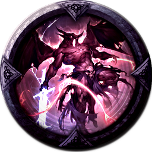 
0DEM10.png
</td>

<td valign="bottom">
 
0DEM11.png
</td>

<td valign="bottom">
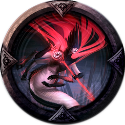 
0DEM12.png
</td>

<td valign="bottom">
 
0DEM13.png
</td>

</tr>
<tr>
<td valign="bottom">
 
0DEM13_0.png
</td>

<td valign="bottom">
 
0DEM14.png
</td>

<td valign="bottom">
 
0DEM15.png
</td>

<td valign="bottom">
 
0DEM15_0.png
</td>

<td valign="bottom">
 
0DEM16.png
</td>

<td valign="bottom">
 
0DEM17.png
</td>

</tr>
<tr>
<td valign="bottom">
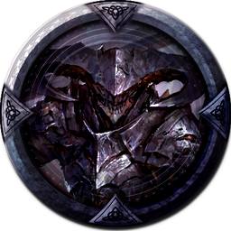 
0DEM17_1.png
</td>

<td valign="bottom">
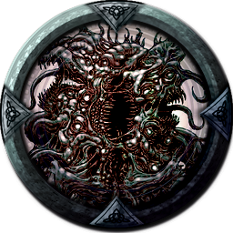 
0DEM18.png
</td>

<td valign="bottom">
 
0DEM18B.png
</td>

<td valign="bottom">
 
0DEM19.png
</td>

<td valign="bottom">
 
0DEM2.png
</td>

<td valign="bottom">
 
0DEM20.png
</td>

</tr>
<tr>
<td valign="bottom">
 
0DEM21.png
</td>

<td valign="bottom">
 
0DEM22.png
</td>

<td valign="bottom">
 
0DEM23.png
</td>

<td valign="bottom">
 
0DEM24.png
</td>

<td valign="bottom">
 
0DEM25.png
</td>

<td valign="bottom">
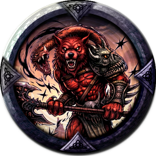 
0DEM26.png
</td>

</tr>
<tr>
<td valign="bottom">
 
0DEM3.png
</td>

<td valign="bottom">
 
0DEM4.png
</td>

<td valign="bottom">
 
0DEM5.png
</td>

<td valign="bottom">
 
0DEM6.png
</td>

<td valign="bottom">
 
0DEM7.png
</td>

<td valign="bottom">
 
0DEM8.png
</td>

</tr>
<tr>
<td valign="bottom">
 
0DEM9.png
</td>

<td valign="bottom">
 
0DEV0.png
</td>

<td valign="bottom">
 
0DEV1.png
</td>

<td valign="bottom">
 
0ELE_RD.png
</td>

<td valign="bottom">
 
0GD_ALTEA2.png
</td>

<td valign="bottom">
 
0GD_ALTEA3.png
</td>

</tr>
<tr>
<td valign="bottom">
 
0GD_ALTEA4.png
</td>

<td valign="bottom">
 
0GD_AZR.png
</td>

<td valign="bottom">
 
0GD_BLN0.png
</td>

<td valign="bottom">
 
0GD_BLN1.png
</td>

<td valign="bottom">
 
0GD_BLN2.png
</td>

<td valign="bottom">
 
0GD_BLN3.png
</td>

</tr>
<tr>
<td valign="bottom">
 
0GD_CHR0.png
</td>

<td valign="bottom">
 
0GD_DREAD.png
</td>

<td valign="bottom">
 
0GD_ERI0.png
</td>

<td valign="bottom">
 
0GD_ERI0_1.png
</td>

<td valign="bottom">
 
0GD_ERI1.png
</td>

<td valign="bottom">
 
0GD_ERI10.png
</td>

</tr>
<tr>
<td valign="bottom">
 
0GD_ERI10_t.png
</td>

<td valign="bottom">
 
0GD_ERI11.png
</td>

<td valign="bottom">
 
0GD_ERI12.png
</td>

<td valign="bottom">
 
0GD_ERI13.png
</td>

<td valign="bottom">
 
0GD_ERI14.png
</td>

<td valign="bottom">
 
0GD_ERI15.png
</td>

</tr>
<tr>
<td valign="bottom">
 
0GD_ERI15_2.png
</td>

<td valign="bottom">
 
0GD_ERI16.png
</td>

<td valign="bottom">
 
0GD_ERI16_2.png
</td>

<td valign="bottom">
 
0GD_ERI17.png
</td>

<td valign="bottom">
 
0GD_ERI18.png
</td>

<td valign="bottom">
 
0GD_ERI19.png
</td>

</tr>
<tr>
<td valign="bottom">
 
0GD_ERI2.png
</td>

<td valign="bottom">
 
0GD_ERI20.png
</td>

<td valign="bottom">
 
0GD_ERI21.png
</td>

<td valign="bottom">
 
0GD_ERI22.png
</td>

<td valign="bottom">
 
0GD_ERI23.png
</td>

<td valign="bottom">
 
0GD_ERI24.png
</td>

</tr>
<tr>
<td valign="bottom">
 
0GD_ERI25.png
</td>

<td valign="bottom">
 
0GD_ERI26.png
</td>

<td valign="bottom">
 
0GD_ERI3.png
</td>

<td valign="bottom">
 
0GD_ERI4.png
</td>

<td valign="bottom">
 
0GD_ERI5.png
</td>

<td valign="bottom">
 
0GD_ERI6.png
</td>

</tr>
<tr>
<td valign="bottom">
 
0GD_ERI7.png
</td>

<td valign="bottom">
 
0GD_ERI8.png
</td>

<td valign="bottom">
 
0GD_ERI9.png
</td>

<td valign="bottom">
 
0GD_GHOST.png
</td>

<td valign="bottom">
 
0GD_HEX0.png
</td>

<td valign="bottom">
 
0GD_HEX1.png
</td>

</tr>
<tr>
<td valign="bottom">
 
0GD_HEX10.png
</td>

<td valign="bottom">
 
0GD_HEX11.png
</td>

<td valign="bottom">
 
0GD_HEX12.png
</td>

<td valign="bottom">
 
0GD_HEX12B.png
</td>

<td valign="bottom">
 
0GD_HEX2.png
</td>

<td valign="bottom">
 
0GD_HEX3.png
</td>

</tr>
<tr>
<td valign="bottom">
 
0GD_HEX4.png
</td>

<td valign="bottom">
 
0GD_HEX5.png
</td>

<td valign="bottom">
 
0GD_HEX6.png
</td>

<td valign="bottom">
 
0GD_HEX7.png
</td>

<td valign="bottom">
 
0GD_HEX8.png
</td>

<td valign="bottom">
 
0GD_HEX9.png
</td>

</tr>
<tr>
<td valign="bottom">
 
0GD_HIRO.png
</td>

<td valign="bottom">
 
0GD_JES.png
</td>

<td valign="bottom">
 
0GD_KMV0.png
</td>

<td valign="bottom">
 
0GD_KMV1.png
</td>

<td valign="bottom">
 
0GD_KRL.png
</td>

<td valign="bottom">
 
0GD_LAT.png
</td>

</tr>
<tr>
<td valign="bottom">
 
0GD_LAT_CL.png
</td>

<td valign="bottom">
 
0GD_OUT.png
</td>

<td valign="bottom">
 
0GD_OUT1.png
</td>

<td valign="bottom">
 
0GD_OUT2.png
</td>

<td valign="bottom">
 
0GD_PEGAS.png
</td>

<td valign="bottom">
 
0GD_PEGAS2.png
</td>

</tr>
<tr>
<td valign="bottom">
 
0GD_SHAI.png
</td>

<td valign="bottom">
 
0GD_SNEK.png
</td>

<td valign="bottom">
 
0GD_SUNE.png
</td>

<td valign="bottom">
 
0GD_TYR.png
</td>

<td valign="bottom">
 
0GD_VELS.png
</td>

<td valign="bottom">
 
0GD_VENTA.png
</td>

</tr>
<tr>
<td valign="bottom">
 
0GRP_ACO.png
</td>

<td valign="bottom">
 
0GRP_ACO1.png
</td>

<td valign="bottom">
 
0GRP_ACO2.png
</td>

<td valign="bottom">
 
0GRP_ACO3.png
</td>

<td valign="bottom">
 
0GRP_ACO4.png
</td>

<td valign="bottom">
 
0GRP_ACO5.png
</td>

</tr>
<tr>
<td valign="bottom">
 
0GRP_ACO6.png
</td>

<td valign="bottom">
 
0GRP_KNG.png
</td>

<td valign="bottom">
 
0GRP_MIH.png
</td>

<td valign="bottom">
 
0IMM_SL0.png
</td>

<td valign="bottom">
 
0LAZ_ARM2.png
</td>

<td valign="bottom">
 
0MEMORY.png
</td>

</tr>
<tr>
<td valign="bottom">
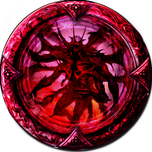 
0MEMORY1.png
</td>

<td valign="bottom">
 
0MEMORY1B.png
</td>

<td valign="bottom">
 
0MEMORY2.png
</td>

<td valign="bottom">
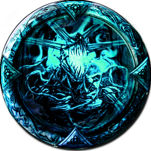 
0MEMORY3.png
</td>

<td valign="bottom">
 
0MEMORY4.png
</td>

<td valign="bottom">
 
0MEMORY5.png
</td>

</tr>
<tr>
<td valign="bottom">
 
0PND_DRKERI.png
</td>

<td valign="bottom">
 
0PND_DRKERI2.png
</td>

<td valign="bottom">
 
0PND_GN0.png
</td>

<td valign="bottom">
 
0PND_GN1.png
</td>

<td valign="bottom">
 
0PND_GN10.png
</td>

<td valign="bottom">
 
0PND_GN10_1.png
</td>

</tr>
<tr>
<td valign="bottom">
 
0PND_GN11.png
</td>

<td valign="bottom">
 
0PND_GN11_1.png
</td>

<td valign="bottom">
 
0PND_GN2.png
</td>

<td valign="bottom">
 
0PND_GN3.png
</td>

<td valign="bottom">
 
0PND_GN4.png
</td>

<td valign="bottom">
 
0PND_GN5.png
</td>

</tr>
<tr>
<td valign="bottom">
 
0PND_GN6.png
</td>

<td valign="bottom">
 
0PND_GN7.png
</td>

<td valign="bottom">
 
0PND_GN8.png
</td>

<td valign="bottom">
 
0PND_GN9.png
</td>

<td valign="bottom">
 
0PND_Hag0.png
</td>

<td valign="bottom">
 
0PND_Hag1.png
</td>

</tr>
<tr>
<td valign="bottom">
 
0PND_Howler.png
</td>

<td valign="bottom">
 
0PND_OGRE0.png
</td>

<td valign="bottom">
 
0PND_OGRE1.png
</td>

<td valign="bottom">
 
0PND_OGRE10.png
</td>

<td valign="bottom">
 
0PND_OGRE11.png
</td>

<td valign="bottom">
 
0PND_OGRE12.png
</td>

</tr>
<tr>
<td valign="bottom">
 
0PND_OGRE13.png
</td>

<td valign="bottom">
 
0PND_OGRE2.png
</td>

<td valign="bottom">
 
0PND_OGRE3.png
</td>

<td valign="bottom">
 
0PND_OGRE4.png
</td>

<td valign="bottom">
 
0PND_OGRE4_1.png
</td>

<td valign="bottom">
 
0PND_OGRE5.png
</td>

</tr>
<tr>
<td valign="bottom">
 
0PND_OGRE6.png
</td>

<td valign="bottom">
 
0PND_OGRE7.png
</td>

<td valign="bottom">
 
0PND_OGRE8.png
</td>

<td valign="bottom">
 
0PND_OGRE9.png
</td>

<td valign="bottom">
 
0PND_PR.png
</td>

<td valign="bottom">
 
0PND_RLNPC0.png
</td>

</tr>
<tr>
<td valign="bottom">
 
0PND_RLNPC1.png
</td>

<td valign="bottom">
 
0PND_RLNPC2.png
</td>

<td valign="bottom">
 
0PND_Weaver.png
</td>

<td valign="bottom">
 
0SH_Fighter.png
</td>

<td valign="bottom">
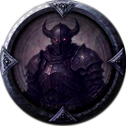 
0SH_Fighter1.png
</td>

<td valign="bottom">
 
0SH_Mage.png
</td>

</tr>
<tr>
<td valign="bottom">
 
0SH_Mage1.png
</td>

<td valign="bottom">
 
0SH_Mage2.png
</td>

<td valign="bottom">
 
0SH_Mage3.png
</td>

<td valign="bottom">
 
0SH_Mage4.png
</td>

<td valign="bottom">
 
0SH_Pyro0.png
</td>

<td valign="bottom">
 
0SH_Pyro1.png
</td>

</tr>
<tr>
<td valign="bottom">
 
0SH_Rogue.png
</td>

<td valign="bottom">
 
0SH_UIT.png
</td>

<td valign="bottom">
 
0SH_UIT_E.png
</td>

<td valign="bottom">
 
0TB_Black.png
</td>

<td valign="bottom">
 
0TB_Red.png
</td>

<td valign="bottom">
 
0TP_AN_0.png
</td>

</tr>
<tr>
<td valign="bottom">
 
0TP_ARCH.png
</td>

<td valign="bottom">
 
0TP_ARCH2.png
</td>

<td valign="bottom">
 
0TP_BLIGHT.png
</td>

<td valign="bottom">
 
0TP_BLIGHT2.png
</td>

<td valign="bottom">
 
0TP_BLIGHT3.png
</td>

<td valign="bottom">
 
0TP_BLIGHT4.png
</td>

</tr>
<tr>
<td valign="bottom">
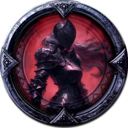 
0TP_BLIGHT5.png
</td>

<td valign="bottom">
 
0TP_DL7.png
</td>

<td valign="bottom">
 
0TP_DL8.png
</td>

<td valign="bottom">
 
0TP_EGER.png
</td>

<td valign="bottom">
 
0TP_EGER1.png
</td>

<td valign="bottom">
 
0TP_EGER2.png
</td>

</tr>
<tr>
<td valign="bottom">
 
0TP_FED_ABER.png
</td>

<td valign="bottom">
 
0TP_FED_ABER1.png
</td>

<td valign="bottom">
 
0TP_FED_ABER2.png
</td>

<td valign="bottom">
 
0TP_FED_ABER_SNK.png
</td>

<td valign="bottom">
 
0TP_FED_ABER_SNK2.png
</td>

<td valign="bottom">
 
0TP_FLESH_PLANE.png
</td>

</tr>
<tr>
<td valign="bottom">
 
0TP_GAR.png
</td>

<td valign="bottom">
 
0TP_GAR_AN.png
</td>

<td valign="bottom">
 
0TP_GAR_AN2.png
</td>

<td valign="bottom">
 
0TP_GAR_ECH.png
</td>

<td valign="bottom">
 
0TP_GAR_ECH1.png
</td>

<td valign="bottom">
 
0TP_GAR_ECH2.png
</td>

</tr>
<tr>
<td valign="bottom">
 
0TP_GAR_MASK.png
</td>

<td valign="bottom">
 
0TP_ILL0.png
</td>

<td valign="bottom">
 
0TP_ILL1.png
</td>

<td valign="bottom">
 
0TP_ILL1_2.png
</td>

<td valign="bottom">
 
0TP_ILL_ABER.png
</td>

<td valign="bottom">
 
0TP_ILL_ABER2.png
</td>

</tr>
<tr>
<td valign="bottom">
 
0TP_JOS0.png
</td>

<td valign="bottom">
 
0TP_JOS1.png
</td>

<td valign="bottom">
 
0TP_JOS2.png
</td>

<td valign="bottom">
 
0TP_JOS3.png
</td>

<td valign="bottom">
 
0TP_JOS4.png
</td>

<td valign="bottom">
 
0TP_JOS5.png
</td>

</tr>
<tr>
<td valign="bottom">
 
0TP_JOS6.png
</td>

<td valign="bottom">
 
0TP_JS0.png
</td>

<td valign="bottom">
 
0TP_JS1.png
</td>

<td valign="bottom">
 
0TP_KOSHMAR.png
</td>

<td valign="bottom">
 
0TP_LAZ0.png
</td>

<td valign="bottom">
 
0TP_LAZ1.png
</td>

</tr>
<tr>
<td valign="bottom">
 
0TP_LAZ2.png
</td>

<td valign="bottom">
 
0TP_LAZ3.png
</td>

<td valign="bottom">
 
0TP_LAZ3_2.png
</td>

<td valign="bottom">
 
0TP_LAZ_S.png
</td>

<td valign="bottom">
 
0TP_OCH_DRG.png
</td>

<td valign="bottom">
 
0TP_OCH_SRC.png
</td>

</tr>
<tr>
<td valign="bottom">
 
0TP_PR_0.png
</td>

<td valign="bottom">
 
0TP_PR_01.png
</td>

<td valign="bottom">
 
0TP_PR_1.png
</td>

<td valign="bottom">
 
0TP_PR_2.png
</td>

<td valign="bottom">
 
0TP_PR_3.png
</td>

<td valign="bottom">
 
0TP_PR_4.png
</td>

</tr>
<tr>
<td valign="bottom">
 
0TP_PR_5.png
</td>

<td valign="bottom">
 
0TP_RAD_N.png
</td>

<td valign="bottom">
 
0TP_RAD_N1.png
</td>

<td valign="bottom">
 
0TP_RAD_N2.png
</td>

<td valign="bottom">
 
0TP_RAD_N3.png
</td>

<td valign="bottom">
 
0TP_RAD_N4.png
</td>

</tr>
<tr>
<td valign="bottom">
 
0TP_RAD_N5.png
</td>

<td valign="bottom">
 
0TP_RAD_N6.png
</td>

<td valign="bottom">
 
0TP_RAD_N7.png
</td>

<td valign="bottom">
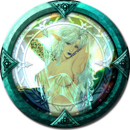 
0TP_RAD_N8.png
</td>

<td valign="bottom">
 
0TP_RAD_NMSK.png
</td>

<td valign="bottom">
 
0TP_RAD_SPEC.png
</td>

</tr>
<tr>
<td valign="bottom">
 
0TP_REICH.png
</td>

<td valign="bottom">
 
0TP_SRR0.png
</td>

<td valign="bottom">
 
0TP_SRR0_1.png
</td>

<td valign="bottom">
 
0TP_SRR1.png
</td>

<td valign="bottom">
 
0TP_SRR1_0.png
</td>

<td valign="bottom">
 
0TP_TIH0.png
</td>

</tr>
<tr>
<td valign="bottom">
 
0TP_TIH1.png
</td>

<td valign="bottom">
 
0TP_TIH2.png
</td>

<td valign="bottom">
 
0TP_TIH3.png
</td>

<td valign="bottom">
 
0TP_TIH4.png
</td>

<td valign="bottom">
 
0TP_TIH5.png
</td>

<td valign="bottom">
 
0TP_TIH5_AR.png
</td>

</tr>
<tr>
<td valign="bottom">
 
0TP_TIH6.png
</td>

<td valign="bottom">
 
0TP_TIH7.png
</td>

<td valign="bottom">
 
0TP_TIH8.png
</td>

<td valign="bottom">
 
0TP_TIH_AL0.png
</td>

<td valign="bottom">
 
0TP_TIH_AL1.png
</td>

<td valign="bottom">
 
0TP_TIH_AL2.png
</td>

</tr>
<tr>
<td valign="bottom">
 
0TP_TIH_DV.png
</td>

<td valign="bottom">
 
0TP_TIH_SG.png
</td>

<td valign="bottom">
 
0TP_TIH_SG2.png
</td>

<td valign="bottom">
 
0TP_WF_0.png
</td>

<td valign="bottom">
 
0TP_WF_1.png
</td>

<td valign="bottom">
 
0TP_WF_2.png
</td>

</tr>
<tr>
<td valign="bottom">
 
0TP_WF_3.png
</td>

<td valign="bottom">
 
0TP_WF_4.png
</td>

<td valign="bottom">
 
0UD_EZMN.png
</td>

<td valign="bottom">
 
0UD_EZMN0.png
</td>

<td valign="bottom">
 
0UD_EZMN1.png
</td>

<td valign="bottom">
 
0UD_EZMN2.png
</td>

</tr>
<tr>
<td valign="bottom">
 
0UD_KNGT0.png
</td>

<td valign="bottom">
 
0UD_KNGT1.png
</td>

<td valign="bottom">
 
0UD_KRO.png
</td>

<td valign="bottom">
 
0UD_MAG0.png
</td>

<td valign="bottom">
 
0UD_SLD0.png
</td>

<td valign="bottom">
 
0UD_SLD1.png
</td>

</tr>
<tr>
<td valign="bottom">
 
0UD_SLD2.png
</td>

<td valign="bottom">
 
0UD_Zombie.png
</td>

<td valign="bottom">
 
0UD_Zombie2.png
</td>

<td valign="bottom">
 
0UD_Zombie2a.png
</td>

<td valign="bottom">
 
0UD_Zombie3_0.png
</td>

<td valign="bottom">
 
0UD_Zombie3_01.png
</td>

</tr>
<tr>
<td valign="bottom">
 
0UD_Zombie4.png
</td>

<td valign="bottom">
 
0UD_Zombie4_5.png
</td>

<td valign="bottom">
 
0UD_Zombie5.png
</td>

<td valign="bottom">
 
0UD_Zombie6.png
</td>

<td valign="bottom">
 
0UD_Zombie7.png
</td>

<td valign="bottom">
 
0UD_Zombie8.png
</td>

</tr>
<tr>
<td valign="bottom">
 
0VIS_0.png
</td>

<td valign="bottom">
 
0VIS_1.png
</td>

<td valign="bottom">
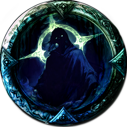 
ABERRANT_LORD0.png
</td>

<td valign="bottom">
 
ABER_CR.png
</td>

<td valign="bottom">
 
ALEXEY.png
</td>

<td valign="bottom">
 
ALEXEY2.png
</td>

</tr>
<tr>
<td valign="bottom">
 
ALEXEY3.png
</td>

<td valign="bottom">
 
ALEXEY3_1.png
</td>

<td valign="bottom">
 
ARCH-FEY.png
</td>

<td valign="bottom">
 
Astra0.png
</td>

<td valign="bottom">
 
AST_0.png
</td>

<td valign="bottom">
 
AST_1.png
</td>

</tr>
<tr>
<td valign="bottom">
 
AST_2.png
</td>

<td valign="bottom">
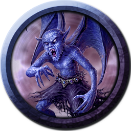 
AST_3.png
</td>

<td valign="bottom">
 
AST_4.png
</td>

<td valign="bottom">
 
AST_5.png
</td>

<td valign="bottom">
 
AST_6.png
</td>

<td valign="bottom">
 
AST_7.png
</td>

</tr>
<tr>
<td valign="bottom">
 
Bean_Caster.png
</td>

<td valign="bottom">
 
BODAK.png
</td>

<td valign="bottom">
 
CatToken.png
</td>

<td valign="bottom">
 
Chitine.png
</td>

<td valign="bottom">
 
Crystal_Golem.png
</td>

<td valign="bottom">
 
DEMON0.png
</td>

</tr>
<tr>
<td valign="bottom">
 
DEMON1.png
</td>

<td valign="bottom">
 
DEVIL0.png
</td>

<td valign="bottom">
 
DEV_CP.png
</td>

<td valign="bottom">
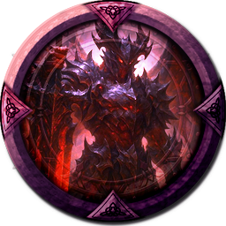 
DEV_CPB.png
</td>

<td valign="bottom">
 
DEV_L0.png
</td>

<td valign="bottom">
 
DEV_L1.png
</td>

</tr>
<tr>
<td valign="bottom">
 
DEV_L10.png
</td>

<td valign="bottom">
 
DEV_L2.png
</td>

<td valign="bottom">
 
DEV_L3.png
</td>

<td valign="bottom">
 
DEV_L4.png
</td>

<td valign="bottom">
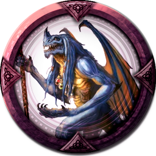 
DEV_L5.png
</td>

<td valign="bottom">
 
DEV_L6.png
</td>

</tr>
<tr>
<td valign="bottom">
 
DEV_L7.png
</td>

<td valign="bottom">
 
DEV_L8.png
</td>

<td valign="bottom">
 
DEV_L8B.png
</td>

<td valign="bottom">
 
DEV_L9.png
</td>

<td valign="bottom">
 
DEV_LCN.png
</td>

<td valign="bottom">
 
DEV_SC.png
</td>

</tr>
<tr>
<td valign="bottom">
 
DEV_SC2.png
</td>

<td valign="bottom">
 
DEV_SC3.png
</td>

<td valign="bottom">
 
DEV_SC4.png
</td>

<td valign="bottom">
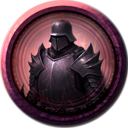 
DEV_UMG.png
</td>

<td valign="bottom">
 
DOBRYAK.png
</td>

<td valign="bottom">
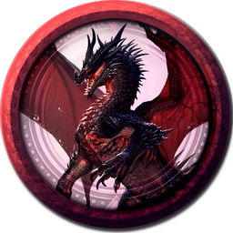 
DRAK0.png
</td>

</tr>
<tr>
<td valign="bottom">
 
DRAK0_KV.png
</td>

<td valign="bottom">
 
DWRF0.png
</td>

<td valign="bottom">
 
ELF_S0.png
</td>

<td valign="bottom">
 
ELF_S1.png
</td>

<td valign="bottom">
 
ELF_S2.png
</td>

<td valign="bottom">
 
ERI_GUNN.png
</td>

</tr>
<tr>
<td valign="bottom">
 
ERI_GUNN2.png
</td>

<td valign="bottom">
 
ERI_GUNN2B.png
</td>

<td valign="bottom">
 
EVMAGE.png
</td>

<td valign="bottom">
 
EVMAGE1.png
</td>

<td valign="bottom">
 
FAM_PANC.png
</td>

<td valign="bottom">
 
GOB0.png
</td>

</tr>
<tr>
<td valign="bottom">
 
GOB1.png
</td>

<td valign="bottom">
 
GOB10.png
</td>

<td valign="bottom">
 
GOB11.png
</td>

<td valign="bottom">
 
GOB12.png
</td>

<td valign="bottom">
 
GOB2.png
</td>

<td valign="bottom">
 
GOB3.png
</td>

</tr>
<tr>
<td valign="bottom">
 
GOB4.png
</td>

<td valign="bottom">
 
GOB5.png
</td>

<td valign="bottom">
 
GOB6.png
</td>

<td valign="bottom">
 
GOB7.png
</td>

<td valign="bottom">
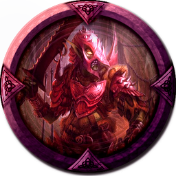 
GOB8.png
</td>

<td valign="bottom">
 
GOB9.png
</td>

</tr>
<tr>
<td valign="bottom">
 
GOB9B.png
</td>

<td valign="bottom">
 
GOLD_DRAG.png
</td>

<td valign="bottom">
 
HAT.png
</td>

<td valign="bottom">
 
HSS.png
</td>

<td valign="bottom">
 
ILL5.png
</td>

<td valign="bottom">
 
ILL6.png
</td>

</tr>
<tr>
<td valign="bottom">
 
ILL6B.png
</td>

<td valign="bottom">
 
INSPECT.png
</td>

<td valign="bottom">
 
INSPECT0.png
</td>

<td valign="bottom">
 
IOG0.png
</td>

<td valign="bottom">
 
IOG1.png
</td>

<td valign="bottom">
 
JS_WISP.png
</td>

</tr>
<tr>
<td valign="bottom">
 
komissarov.png
</td>

<td valign="bottom">
 
komissarov2.png
</td>

<td valign="bottom">
 
LAND_EMPEROR.png
</td>

<td valign="bottom">
 
LAND_EMPEROR_B.png
</td>

<td valign="bottom">
 
LD_S7_3.png
</td>

<td valign="bottom">
 
LZ_0.png
</td>

</tr>
<tr>
<td valign="bottom">
 
LZ_1.png
</td>

<td valign="bottom">
 
LZ_2.png
</td>

<td valign="bottom">
 
LZ_3.png
</td>

<td valign="bottom">
 
LZ_4.png
</td>

<td valign="bottom">
 
LZ_5.png
</td>

<td valign="bottom">
 
LZ_6.png
</td>

</tr>
<tr>
<td valign="bottom">
 
LZ_SORC.png
</td>

<td valign="bottom">
 
Maes0.png
</td>

<td valign="bottom">
 
Maes1.png
</td>

<td valign="bottom">
 
Memory0.png
</td>

<td valign="bottom">
 
Memory1.png
</td>

<td valign="bottom">
 
Memory2.png
</td>

</tr>
<tr>
<td valign="bottom">
 
Memory3.png
</td>

<td valign="bottom">
 
Memory4.png
</td>

<td valign="bottom">
 
Memory5.png
</td>

<td valign="bottom">
 
MTH.png
</td>

<td valign="bottom">
 
NB4_W.png.png
</td>

<td valign="bottom">
 
Noble_0.png
</td>

</tr>
<tr>
<td valign="bottom">
 
PIR0.png
</td>

<td valign="bottom">
 
PIR0B.png
</td>

<td valign="bottom">
 
PIR0C.png
</td>

<td valign="bottom">
 
Rad_sova.png
</td>

<td valign="bottom">
 
SHADOW.png
</td>

<td valign="bottom">
 
SHdd.png
</td>

</tr>
<tr>
<td valign="bottom">
 
SHDH.png
</td>

<td valign="bottom">
 
SHDH2.png
</td>

<td valign="bottom">
 
SHDH3.png
</td>

<td valign="bottom">
 
SKRIPKA.png
</td>

<td valign="bottom">
 
SLAA_0.png
</td>

<td valign="bottom">
 
SLAA_1.png
</td>

</tr>
<tr>
<td valign="bottom">
 
SLAA_2.png
</td>

<td valign="bottom">
 
SLAA_3.png
</td>

<td valign="bottom">
 
SLAA_4.png
</td>

<td valign="bottom">
 
SLAA_5.png
</td>

<td valign="bottom">
 
SLD.png
</td>

<td valign="bottom">
 
SLD1.png
</td>

</tr>
<tr>
<td valign="bottom">
 
SLD2.png
</td>

<td valign="bottom">
 
SLD2_2.png
</td>

<td valign="bottom">
 
TARRASK.png
</td>

<td valign="bottom">
 
TPC_0.png
</td>

<td valign="bottom">
 
TPC_1.png
</td>

<td valign="bottom">
 
TPC_10.png
</td>

</tr>
<tr>
<td valign="bottom">
 
TPC_11.png
</td>

<td valign="bottom">
 
TPC_12.png
</td>

<td valign="bottom">
 
TPC_13.png
</td>

<td valign="bottom">
 
TPC_14.png
</td>

<td valign="bottom">
 
TPC_15.png
</td>

<td valign="bottom">
 
TPC_16.png
</td>

</tr>
<tr>
<td valign="bottom">
 
TPC_17.png
</td>

<td valign="bottom">
 
TPC_17_1.png
</td>

<td valign="bottom">
 
TPC_18.png
</td>

<td valign="bottom">
 
TPC_19.png
</td>

<td valign="bottom">
 
TPC_2.png
</td>

<td valign="bottom">
 
TPC_20.png
</td>

</tr>
<tr>
<td valign="bottom">
 
TPC_21.png
</td>

<td valign="bottom">
 
TPC_22.png
</td>

<td valign="bottom">
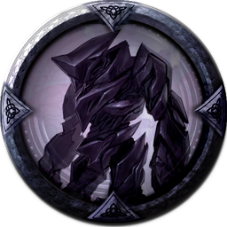 
TPC_23.png
</td>

<td valign="bottom">
 
TPC_24.png
</td>

<td valign="bottom">
 
TPC_3.png
</td>

<td valign="bottom">
 
TPC_4.png
</td>

</tr>
<tr>
<td valign="bottom">
 
TPC_5.png
</td>

<td valign="bottom">
 
TPC_6.png
</td>

<td valign="bottom">
 
TPC_7.png
</td>

<td valign="bottom">
 
TPC_8.png
</td>

<td valign="bottom">
 
TPC_9.png
</td>

<td valign="bottom">
 
TPC_AMN.png
</td>

</tr>
<tr>
<td valign="bottom">
 
TPC_AUT.png
</td>

<td valign="bottom">
 
TPC_KEN.png
</td>

<td valign="bottom">
 
TPC_LF.png
</td>

<td valign="bottom">
 
TPC_LF1.png
</td>

<td valign="bottom">
 
TPC_LF2.png
</td>

<td valign="bottom">
 
TPC_LF3.png
</td>

</tr>
<tr>
<td valign="bottom">
 
TPC_LF4.png
</td>

<td valign="bottom">
 
TPC_LF5.png
</td>

<td valign="bottom">
 
TPC_LF6.png
</td>

<td valign="bottom">
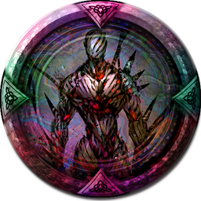 
TPC_LF7.png
</td>

<td valign="bottom">
 
TPC_LF8.png
</td>

<td valign="bottom">
 
TPC_REOS.png
</td>

</tr>
<tr>
<td valign="bottom">
 
TPC_REOS2.png
</td>

<td valign="bottom">
 
TPC_REOS3.png
</td>

<td valign="bottom">
 
TPM_0.png
</td>

<td valign="bottom">
 
TPM_1.png
</td>

<td valign="bottom">
 
TPM_2.png
</td>

<td valign="bottom">
 
TPM_3.png
</td>

</tr>
<tr>
<td valign="bottom">
 
TPM_4.png
</td>

<td valign="bottom">
 
TPM_5.png
</td>

<td valign="bottom">
 
TS_Vamp.png
</td>

<td valign="bottom">
 
UNO_0.png
</td>

<td valign="bottom">
 
UNO_1.png
</td>

<td valign="bottom">
 
UNO_2.png
</td>

</tr>
<tr>
<td valign="bottom">
 
UNO_3.png
</td>

<td valign="bottom">
 
Uno_raksh.png
</td>

<td valign="bottom">
 
VARFOLOMEI.png
</td>

<td valign="bottom">
 
WORM0.png
</td>

<td valign="bottom">
 
WORM1.png
</td>

<td valign="bottom">
 
WORM2.png
</td>

</tr></table>