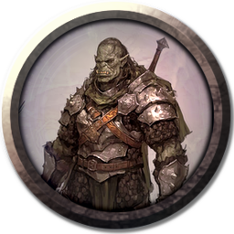
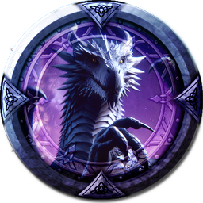
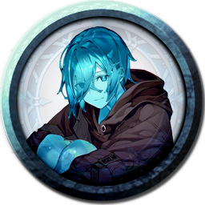

[Основные Токены](https://github.com/CatacombNoop/ktms-tokens/blob/main/images_main/README.md) |
[Основные Токены 2](https://github.com/CatacombNoop/ktms-tokens/blob/main/images_main2/README.md) |
[Мудроградовки](https://github.com/CatacombNoop/ktms-tokens/blob/main/images_mudrog/README.md) |
[Иконки](https://github.com/CatacombNoop/ktms-tokens/blob/main/images_icons/README.md) |
[Иконки Доп.](https://github.com/CatacombNoop/ktms-tokens/blob/main/images_icons2/README.md) |
[Эффекты](https://github.com/CatacombNoop/ktms-tokens/blob/main/images_sfx/README.md) |
[Токены Марка](https://github.com/CatacombNoop/ktms-tokens/blob/main/images_mark/README.md) |
[Одиум](https://github.com/CatacombNoop/ktms-tokens/blob/main/images_odium/README.md) |
<table><tr>
<tr>
<td valign="bottom">
 
0GD_ALTEA2.png
</td>

<td valign="bottom">
 
0GD_CHR0.png
</td>

<td valign="bottom">
 
0GD_HEX0.png
</td>

<td valign="bottom">
 
0GD_HEX1.png
</td>

<td valign="bottom">
 
0GD_HEX10.png
</td>

<td valign="bottom">
 
0GD_HEX2.png
</td>

</tr>
<tr>
<td valign="bottom">
 
0GD_HEX3.png
</td>

<td valign="bottom">
 
0GD_HEX4.png
</td>

<td valign="bottom">
 
0GD_HEX5.png
</td>

<td valign="bottom">
 
0GD_HEX6.png
</td>

<td valign="bottom">
 
0GD_HEX7.png
</td>

<td valign="bottom">
 
0GD_HEX8.png
</td>

</tr>
<tr>
<td valign="bottom">
 
0GD_HEX9.png
</td>

<td valign="bottom">
 
0GD_JES.png
</td>

<td valign="bottom">
 
0GD_SNEK.png
</td>

<td valign="bottom">
 
0TP_EGER.png
</td>

<td valign="bottom">
 
0TP_EGER1.png
</td>

<td valign="bottom">
 
0TP_TIH0.png
</td>

</tr>
<tr>
<td valign="bottom">
 
0TP_TIH1.png
</td>

<td valign="bottom">
 
0TP_TIH2.png
</td>

<td valign="bottom">
 
0TP_TIH3.png
</td>

<td valign="bottom">
 
0TP_TIH4.png
</td>

<td valign="bottom">
 
0TP_TIH_DV.png
</td>

<td valign="bottom">
 
0TP_TIH_SG.png
</td>

</tr>
<tr>
<td valign="bottom">
 
0TP_TIH_SG2.png
</td>

<td valign="bottom">
 
ABER_CR.png
</td>

<td valign="bottom">
 
MTH.png
</td>

<td valign="bottom">
 
PIR0.png
</td>

<td valign="bottom">
 
Rad_sova.png
</td>

<td valign="bottom">
 
UNO_0.png
</td>

</tr>
<tr>
<td valign="bottom">
 
UNO_1.png
</td>

<td valign="bottom">
 
UNO_2.png
</td>

</tr></table>