[Основные Токены](https://github.com/CatacombNoop/ktms-tokens/blob/main/images_main/README.md) |
[Основные Токены 2](https://github.com/CatacombNoop/ktms-tokens/blob/main/images_main2/README.md) |
[Мудроградовки](https://github.com/CatacombNoop/ktms-tokens/blob/main/images_mudrog/README.md) |
[Иконки](https://github.com/CatacombNoop/ktms-tokens/blob/main/images_icons/README.md) |
[Иконки Доп.](https://github.com/CatacombNoop/ktms-tokens/blob/main/images_icons2/README.md) |
[Эффекты](https://github.com/CatacombNoop/ktms-tokens/blob/main/images_sfx/README.md) |
[Токены Марка](https://github.com/CatacombNoop/ktms-tokens/blob/main/images_mark/README.md) |
[Одиум](https://github.com/CatacombNoop/ktms-tokens/blob/main/images_odium/README.md) |
[Карты](https://github.com/CatacombNoop/ktms-tokens/blob/main/images_maps/README.md) |
[**Вики**](https://github.com/CatacombNoop/ktms-tokens/wiki) |
<table><tr>
<tr>
<td valign="bottom">
 
BloodCrypt_Grid_32x56.jpg
</td>

<td valign="bottom">
 
City Streets-Night.jpg
</td>

<td valign="bottom">
 
Entra32x56.jpg
</td>

<td valign="bottom">
 
EVI_36x21.jpg
</td>

<td valign="bottom">
 
EVI_36x21B.jpg
</td>

<td valign="bottom">
 
HellFortress.png
</td>

</tr>
<tr>
<td valign="bottom">
 
Jung.jpg
</td>

<td valign="bottom">
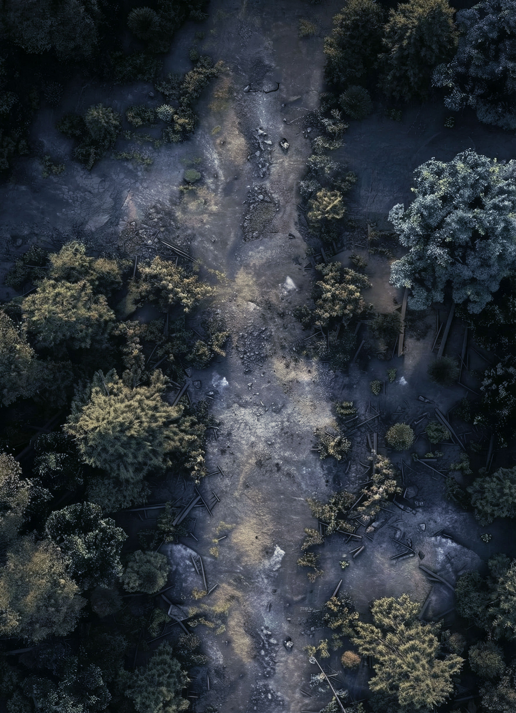 
Jung2.jpg
</td>

<td valign="bottom">
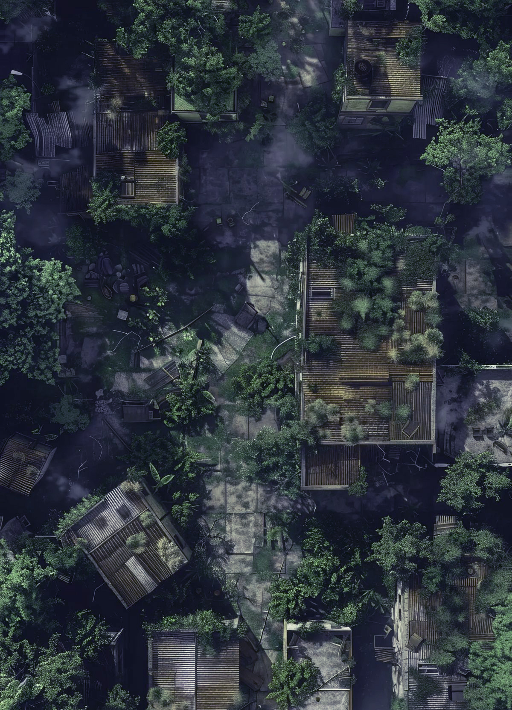 
JungCT.jpg
</td>

<td valign="bottom">
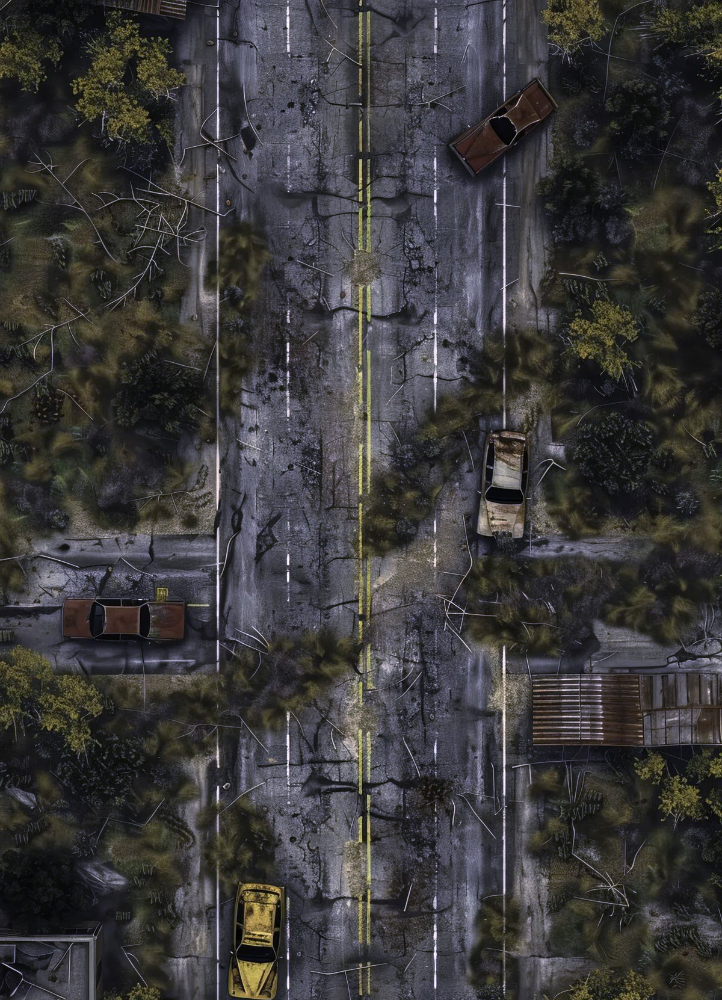 
JungCT1.jpg
</td>

<td valign="bottom">
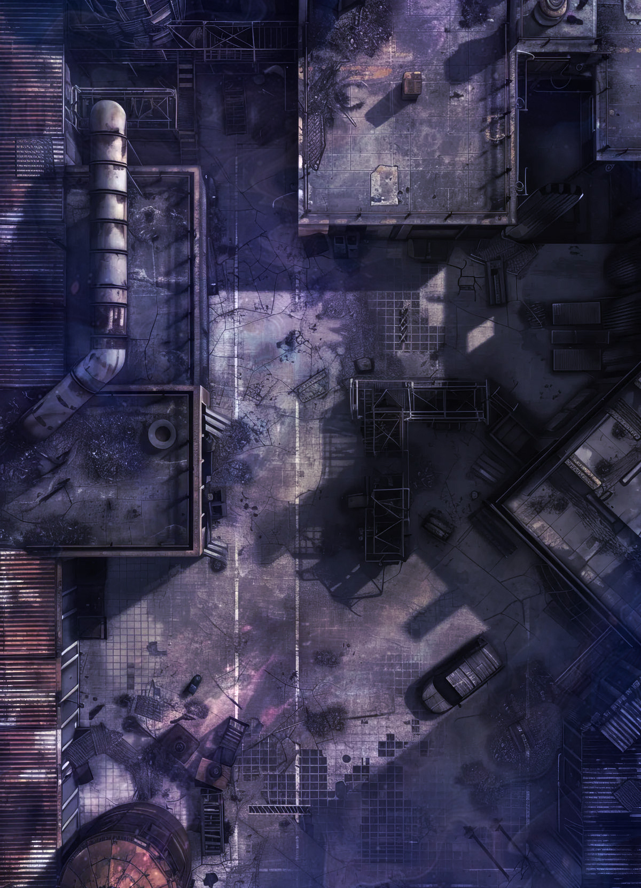 
JungCT2.jpg
</td>

<td valign="bottom">
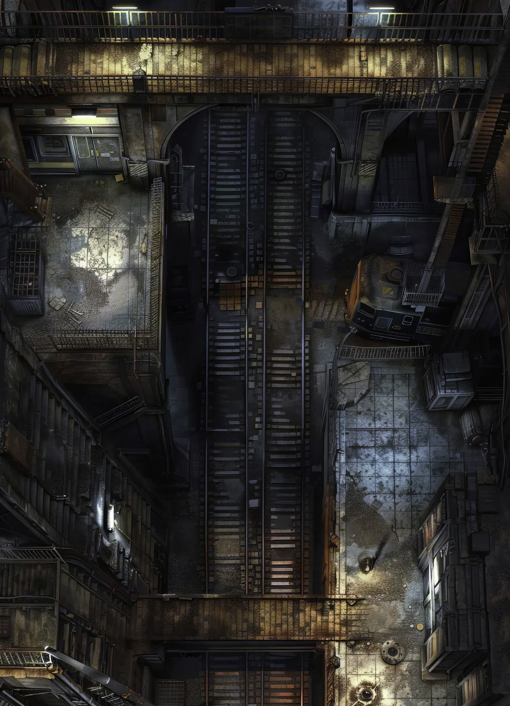 
JungCT3.jpg
</td>

</tr>
<tr>
<td valign="bottom">
 
LAIR-INFO.png
</td>

<td valign="bottom">
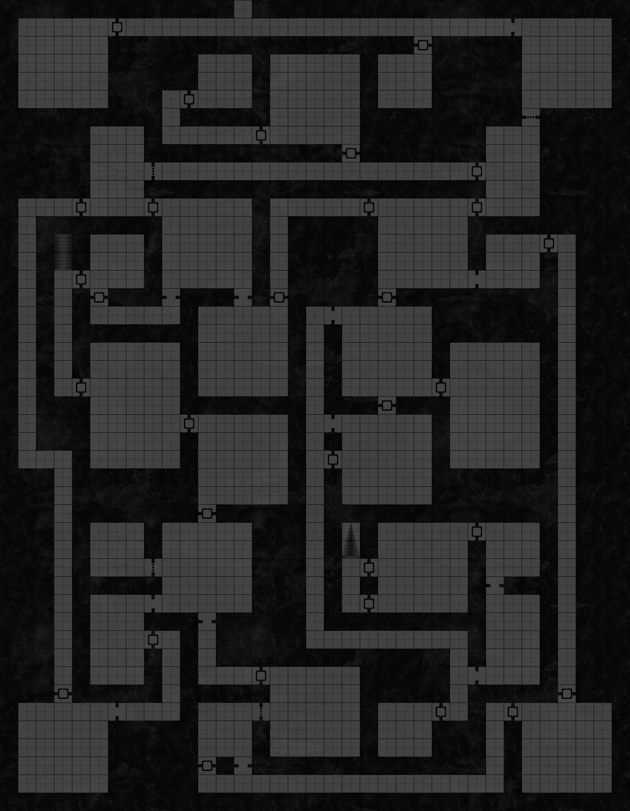 
LAIR.png
</td>

<td valign="bottom">
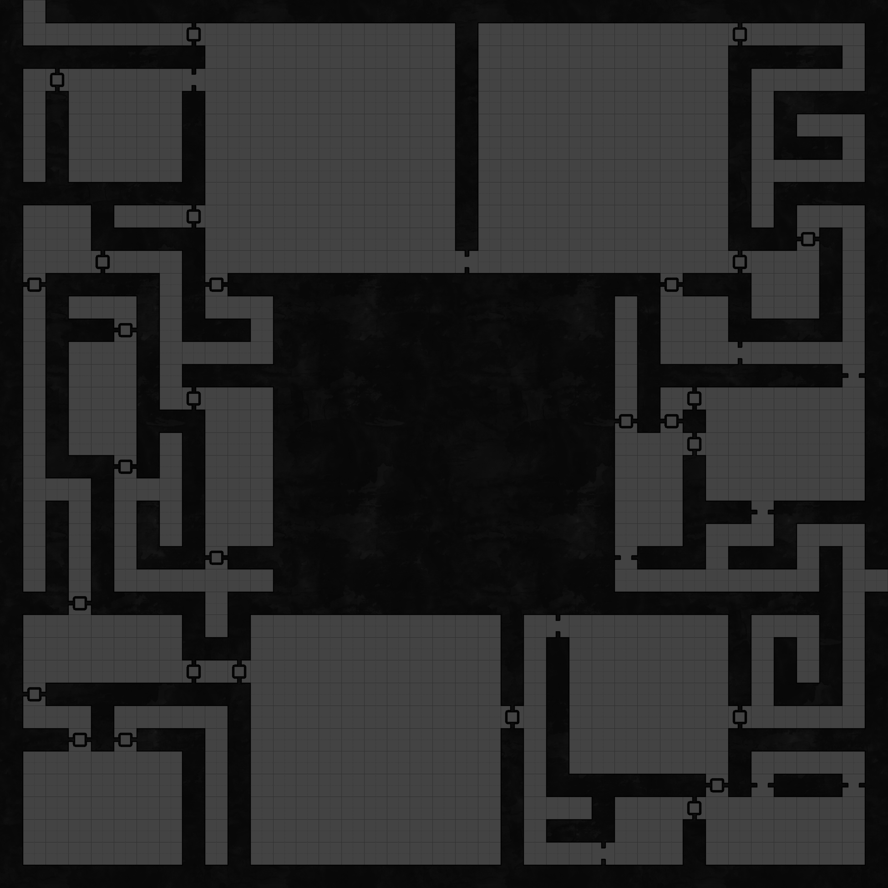 
LAIR2_j.jpg
</td>

<td valign="bottom">
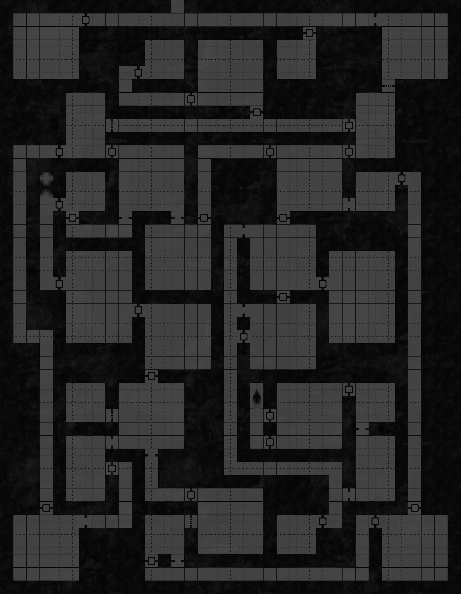 
LAIR_j.jpg
</td>

<td valign="bottom">
 
LAIR_REO.jpg
</td>

<td valign="bottom">
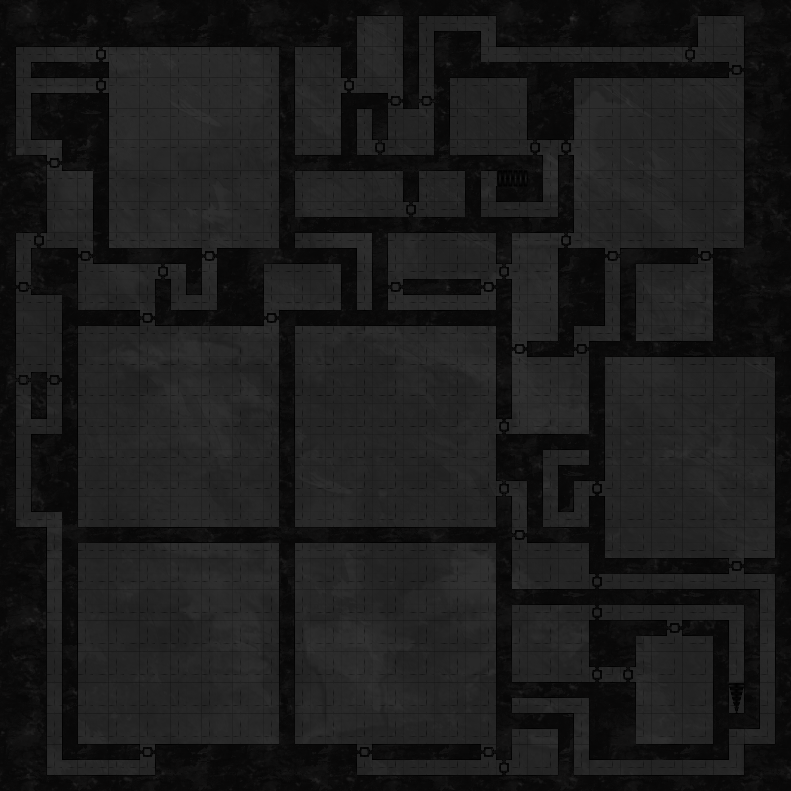 
LAIR_REO.png
</td>

</tr>
<tr>
<td valign="bottom">
 
Mns.jpg
</td>

<td valign="bottom">
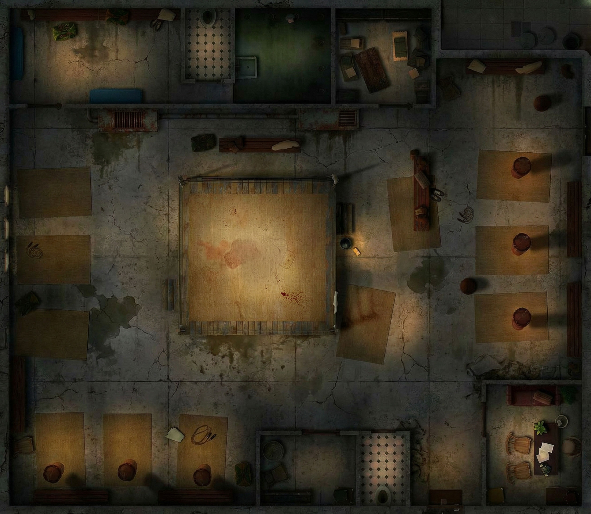 
Ring_Battle.jpg
</td>

<td valign="bottom">
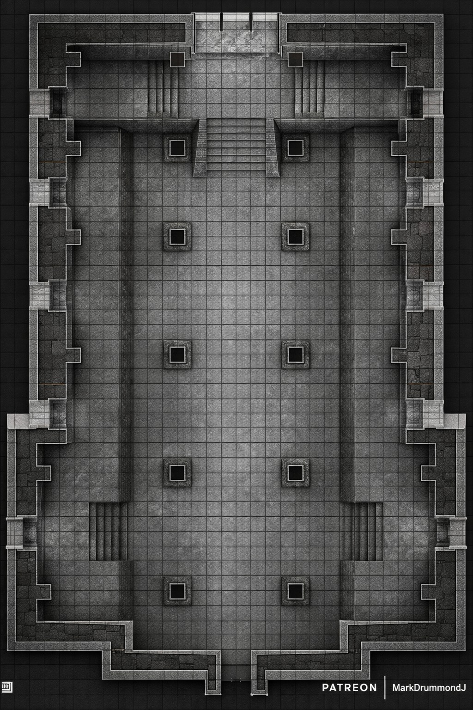 
SPACE_C.jpg
</td>

<td valign="bottom">
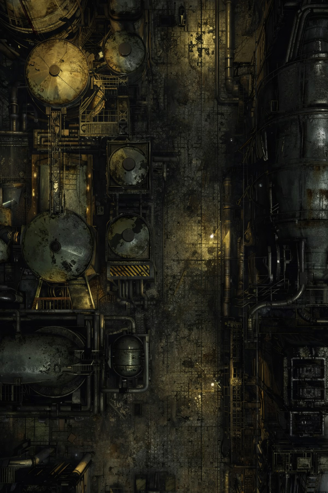 
ZVND0.jpg
</td>

</tr></table>