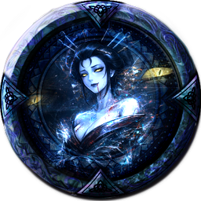

[Основные Токены](https://github.com/CatacombNoop/ktms-tokens/blob/main/images_main/README.md) |
[Основные Токены 2](https://github.com/CatacombNoop/ktms-tokens/blob/main/images_main2/README.md) |
[Мудроградовки](https://github.com/CatacombNoop/ktms-tokens/blob/main/images_mudrog/README.md) |
[Иконки](https://github.com/CatacombNoop/ktms-tokens/blob/main/images_icons/README.md) |
[Иконки Доп.](https://github.com/CatacombNoop/ktms-tokens/blob/main/images_icons2/README.md) |
[Эффекты](https://github.com/CatacombNoop/ktms-tokens/blob/main/images_sfx/README.md) |
[Токены Марка](https://github.com/CatacombNoop/ktms-tokens/blob/main/images_mark/README.md) |
[Одиум](https://github.com/CatacombNoop/ktms-tokens/blob/main/images_odium/README.md) |
[Карты](https://github.com/CatacombNoop/ktms-tokens/blob/main/images_maps/README.md) |
[**Вики**](https://github.com/CatacombNoop/ktms-tokens/wiki) |
<table><tr>
<tr>
<td valign="bottom">
 
AELF.png
</td>

<td valign="bottom">
 
ALEPH.png
</td>

<td valign="bottom">
 
ANG0.png
</td>

<td valign="bottom">
 
ANG1.png
</td>

<td valign="bottom">
 
ANG2.png
</td>

<td valign="bottom">
 
ARS0.png
</td>

</tr>
<tr>
<td valign="bottom">
 
DAR0.png
</td>

<td valign="bottom">
 
DAR_F.png
</td>

<td valign="bottom">
 
Drrr.png
</td>

<td valign="bottom">
 
EOL.png
</td>

<td valign="bottom">
 
GLEB.png
</td>

<td valign="bottom">
 
GLEB_F.png
</td>

</tr>
<tr>
<td valign="bottom">
 
GOKU.png
</td>

<td valign="bottom">
 
IO.png
</td>

<td valign="bottom">
 
JS0.png
</td>

<td valign="bottom">
 
JS0_1.png
</td>

<td valign="bottom">
 
JS1.png
</td>

<td valign="bottom">
 
JS1_1.png
</td>

</tr>
<tr>
<td valign="bottom">
 
JS2.png
</td>

<td valign="bottom">
 
JS2_1.png
</td>

<td valign="bottom">
 
JSF0.png
</td>

<td valign="bottom">
 
JSF1.png
</td>

<td valign="bottom">
 
MTN.png
</td>

<td valign="bottom">
 
MTN2.png
</td>

</tr>
<tr>
<td valign="bottom">
 
MTN3.png
</td>

<td valign="bottom">
 
MTN4.png
</td>

<td valign="bottom">
 
MTN5.png
</td>

<td valign="bottom">
 
MTN6.png
</td>

<td valign="bottom">
 
MTN7.png
</td>

<td valign="bottom">
 
MTN8.png
</td>

</tr>
<tr>
<td valign="bottom">
 
ROMAN.png
</td>

<td valign="bottom">
 
ROMAN2.png
</td>

<td valign="bottom">
 
SEIR.png
</td>

<td valign="bottom">
 
starrrr.png
</td>

<td valign="bottom">
 
S_TK.png
</td>

<td valign="bottom">
 
teqilla_sunset.png
</td>

</tr>
<tr>
<td valign="bottom">
 
tequilla_up.png
</td>

<td valign="bottom">
 
TIH.png
</td>

<td valign="bottom">
 
TIH1.png
</td>

<td valign="bottom">
 
token_1_14.png
</td>

<td valign="bottom">
 
token_1_20.png
</td>

<td valign="bottom">
 
token_2_7.png
</td>

</tr>
<tr>
<td valign="bottom">
 
token_2_8.png
</td>

<td valign="bottom">
 
token_3_3.png
</td>

<td valign="bottom">
 
token_4_2.png
</td>

<td valign="bottom">
 
TRADER.png
</td>

<td valign="bottom">
 
TRC0.png
</td>

<td valign="bottom">
 
TRC1.png
</td>

</tr>
<tr>
<td valign="bottom">
 
WFR.png
</td>

<td valign="bottom">
 
еаа.png
</td>

<td valign="bottom">
 
еаа2.png
</td>

</tr></table>