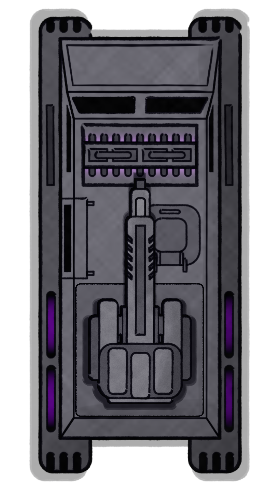

[Основные Токены](https://github.com/CatacombNoop/ktms-tokens/blob/main/images_main/README.md) |
[Основные Токены 2](https://github.com/CatacombNoop/ktms-tokens/blob/main/images_main2/README.md) |
[Мудроградовки](https://github.com/CatacombNoop/ktms-tokens/blob/main/images_mudrog/README.md) |
[Иконки](https://github.com/CatacombNoop/ktms-tokens/blob/main/images_icons/README.md) |
[Иконки Доп.](https://github.com/CatacombNoop/ktms-tokens/blob/main/images_icons2/README.md) |
[Эффекты](https://github.com/CatacombNoop/ktms-tokens/blob/main/images_sfx/README.md) |
[Токены Марка](https://github.com/CatacombNoop/ktms-tokens/blob/main/images_mark/README.md) |
[Одиум](https://github.com/CatacombNoop/ktms-tokens/blob/main/images_odium/README.md) |
[Карты](https://github.com/CatacombNoop/ktms-tokens/blob/main/images_maps/README.md) |
[**Вики**](https://github.com/CatacombNoop/ktms-tokens/wiki) |
<table><tr>
<tr>
<td valign="bottom">
 
AUTT0.png
</td>

<td valign="bottom">
 
AUTT1.png
</td>

<td valign="bottom">
 
AZR0.png
</td>

<td valign="bottom">
 
A_SLD0.png
</td>

<td valign="bottom">
 
A_SLD1.png
</td>

<td valign="bottom">
 
A_SLD1_A.png
</td>

</tr>
<tr>
<td valign="bottom">
 
A_SLD2.png
</td>

<td valign="bottom">
 
A_SLD3.png
</td>

<td valign="bottom">
 
BLD0.png
</td>

<td valign="bottom">
 
BLD1.png
</td>

<td valign="bottom">
 
BLD2.png
</td>

<td valign="bottom">
 
BRA0].png
</td>

</tr>
<tr>
<td valign="bottom">
 
BRA1.png
</td>

<td valign="bottom">
 
CROC.png
</td>

<td valign="bottom">
 
DOC.png
</td>

<td valign="bottom">
 
FEDT0.png
</td>

<td valign="bottom">
 
FEDT1.png
</td>

<td valign="bottom">
 
FEDT2.png
</td>

</tr>
<tr>
<td valign="bottom">
 
FEDT3.png
</td>

<td valign="bottom">
 
FEDT4.png
</td>

<td valign="bottom">
 
GITH.png
</td>

<td valign="bottom">
 
ILL0.png
</td>

<td valign="bottom">
 
ILL1.png
</td>

<td valign="bottom">
 
ILL2.png
</td>

</tr>
<tr>
<td valign="bottom">
 
ILLARIA0.png
</td>

<td valign="bottom">
 
ILLARIA1.png
</td>

<td valign="bottom">
 
ILLARIA2.png
</td>

<td valign="bottom">
 
INF.png
</td>

<td valign="bottom">
 
KILLER0.png
</td>

<td valign="bottom">
 
machinegun.png
</td>

</tr>
<tr>
<td valign="bottom">
 
MIKU0.png
</td>

<td valign="bottom">
 
NPC0.png
</td>

<td valign="bottom">
 
NPC01.png
</td>

<td valign="bottom">
 
NPC02.png
</td>

<td valign="bottom">
 
NPC1.png
</td>

<td valign="bottom">
 
NPC10.png
</td>

</tr>
<tr>
<td valign="bottom">
 
NPC11.png
</td>

<td valign="bottom">
 
NPC12.png
</td>

<td valign="bottom">
 
NPC13.png
</td>

<td valign="bottom">
 
NPC14.png
</td>

<td valign="bottom">
 
NPC15.png
</td>

<td valign="bottom">
 
NPC16.png
</td>

</tr>
<tr>
<td valign="bottom">
 
NPC17.png
</td>

<td valign="bottom">
 
NPC18.png
</td>

<td valign="bottom">
 
NPC19.png
</td>

<td valign="bottom">
 
NPC2.png
</td>

<td valign="bottom">
 
NPC20.png
</td>

<td valign="bottom">
 
NPC21.png
</td>

</tr>
<tr>
<td valign="bottom">
 
NPC22.png
</td>

<td valign="bottom">
 
NPC23.png
</td>

<td valign="bottom">
 
NPC24.png
</td>

<td valign="bottom">
 
NPC25.png
</td>

<td valign="bottom">
 
NPC26.png
</td>

<td valign="bottom">
 
NPC27.png
</td>

</tr>
<tr>
<td valign="bottom">
 
NPC28.png
</td>

<td valign="bottom">
 
NPC282.png
</td>

<td valign="bottom">
 
NPC29.png
</td>

<td valign="bottom">
 
NPC3.png
</td>

<td valign="bottom">
 
NPC30.png
</td>

<td valign="bottom">
 
NPC31.png
</td>

</tr>
<tr>
<td valign="bottom">
 
NPC32.png
</td>

<td valign="bottom">
 
NPC33.png
</td>

<td valign="bottom">
 
NPC33_1.png
</td>

<td valign="bottom">
 
NPC34.png
</td>

<td valign="bottom">
 
NPC34_4.png
</td>

<td valign="bottom">
 
NPC35.png
</td>

</tr>
<tr>
<td valign="bottom">
 
NPC36.png
</td>

<td valign="bottom">
 
NPC36_2.png
</td>

<td valign="bottom">
 
NPC37.png
</td>

<td valign="bottom">
 
NPC38.png
</td>

<td valign="bottom">
 
NPC39.png
</td>

<td valign="bottom">
 
NPC4.png
</td>

</tr>
<tr>
<td valign="bottom">
 
NPC40.png
</td>

<td valign="bottom">
 
NPC41.png
</td>

<td valign="bottom">
 
NPC42.png
</td>

<td valign="bottom">
 
NPC43.png
</td>

<td valign="bottom">
 
NPC44.png
</td>

<td valign="bottom">
 
NPC45.png
</td>

</tr>
<tr>
<td valign="bottom">
 
NPC46.png
</td>

<td valign="bottom">
 
NPC47.png
</td>

<td valign="bottom">
 
NPC48.png
</td>

<td valign="bottom">
 
NPC49.png
</td>

<td valign="bottom">
 
NPC49B.png
</td>

<td valign="bottom">
 
NPC5.png
</td>

</tr>
<tr>
<td valign="bottom">
 
NPC50.png
</td>

<td valign="bottom">
 
NPC51.png
</td>

<td valign="bottom">
 
NPC52.png
</td>

<td valign="bottom">
 
NPC53.png
</td>

<td valign="bottom">
 
NPC54.png
</td>

<td valign="bottom">
 
NPC54_2.png
</td>

</tr>
<tr>
<td valign="bottom">
 
NPC54_3.png
</td>

<td valign="bottom">
 
NPC54_4.png
</td>

<td valign="bottom">
 
NPC54_5.png
</td>

<td valign="bottom">
 
NPC54_6.png
</td>

<td valign="bottom">
 
NPC55.png
</td>

<td valign="bottom">
 
NPC56.png
</td>

</tr>
<tr>
<td valign="bottom">
 
NPC57.png
</td>

<td valign="bottom">
 
NPC58.png
</td>

<td valign="bottom">
 
NPC58B.png
</td>

<td valign="bottom">
 
NPC58_1.png
</td>

<td valign="bottom">
 
NPC59.png
</td>

<td valign="bottom">
 
NPC6.png
</td>

</tr>
<tr>
<td valign="bottom">
 
NPC60.png
</td>

<td valign="bottom">
 
NPC61.png
</td>

<td valign="bottom">
 
NPC62.png
</td>

<td valign="bottom">
 
NPC63.png
</td>

<td valign="bottom">
 
NPC64.png
</td>

<td valign="bottom">
 
NPC65.png
</td>

</tr>
<tr>
<td valign="bottom">
 
NPC66.png
</td>

<td valign="bottom">
 
NPC67.png
</td>

<td valign="bottom">
 
NPC68.png
</td>

<td valign="bottom">
 
NPC69.png
</td>

<td valign="bottom">
 
NPC7.png
</td>

<td valign="bottom">
 
NPC70.png
</td>

</tr>
<tr>
<td valign="bottom">
 
NPC71.png
</td>

<td valign="bottom">
 
NPC72.png
</td>

<td valign="bottom">
 
NPC73.png
</td>

<td valign="bottom">
 
NPC74.png
</td>

<td valign="bottom">
 
NPC75.png
</td>

<td valign="bottom">
 
NPC76.png
</td>

</tr>
<tr>
<td valign="bottom">
 
NPC76B.png
</td>

<td valign="bottom">
 
NPC76C.png
</td>

<td valign="bottom">
 
NPC76_1.png
</td>

<td valign="bottom">
 
NPC76_2.png
</td>

<td valign="bottom">
 
NPC77.png
</td>

<td valign="bottom">
 
NPC77_1.png
</td>

</tr>
<tr>
<td valign="bottom">
 
NPC77_2.png
</td>

<td valign="bottom">
 
NPC78.png
</td>

<td valign="bottom">
 
NPC79.png
</td>

<td valign="bottom">
 
NPC8.png
</td>

<td valign="bottom">
 
NPC80.png
</td>

<td valign="bottom">
 
NPC81.png
</td>

</tr>
<tr>
<td valign="bottom">
 
NPC82.png
</td>

<td valign="bottom">
 
NPC83.png
</td>

<td valign="bottom">
 
NPC84.png
</td>

<td valign="bottom">
 
NPC85.png
</td>

<td valign="bottom">
 
NPC9.png
</td>

<td valign="bottom">
 
NPC_HACK.png
</td>

</tr>
<tr>
<td valign="bottom">
 
NPC_VM0.png
</td>

<td valign="bottom">
 
NPC_VM1.png
</td>

<td valign="bottom">
 
NPC_VM2.png
</td>

<td valign="bottom">
 
PAS0.png
</td>

<td valign="bottom">
 
PC0.png
</td>

<td valign="bottom">
 
PC0_A.png
</td>

</tr>
<tr>
<td valign="bottom">
 
PC0_B.png
</td>

<td valign="bottom">
 
PC1.png
</td>

<td valign="bottom">
 
PC1_S.png
</td>

<td valign="bottom">
 
PC2.png
</td>

<td valign="bottom">
 
PC2_B.png
</td>

<td valign="bottom">
 
PC2_C.png
</td>

</tr>
<tr>
<td valign="bottom">
 
PC3.png
</td>

<td valign="bottom">
 
PC3_1.png
</td>

<td valign="bottom">
 
PC3_2.png
</td>

<td valign="bottom">
 
PC3_3.png
</td>

<td valign="bottom">
 
PC3_4.png
</td>

<td valign="bottom">
 
PC3_5.png
</td>

</tr>
<tr>
<td valign="bottom">
 
PC3_6.png
</td>

<td valign="bottom">
 
PC3_6B.png
</td>

<td valign="bottom">
 
PC3_6C.png
</td>

<td valign="bottom">
 
PC3_6D.png
</td>

<td valign="bottom">
 
planer.png
</td>

<td valign="bottom">
 
planer2.png
</td>

</tr>
<tr>
<td valign="bottom">
 
planer3.png
</td>

<td valign="bottom">
 
planer4.png
</td>

<td valign="bottom">
 
planer4B.png
</td>

<td valign="bottom">
 
planer5.png
</td>

<td valign="bottom">
 
planer6.png
</td>

<td valign="bottom">
 
planer67.png
</td>

</tr>
<tr>
<td valign="bottom">
 
planer68.png
</td>

<td valign="bottom">
 
planer8.png
</td>

<td valign="bottom">
 
planer9.png
</td>

<td valign="bottom">
 
PLN0.png
</td>

<td valign="bottom">
 
PLN1.png
</td>

<td valign="bottom">
 
PLN12.png
</td>

</tr>
<tr>
<td valign="bottom">
 
PLN122.png
</td>

<td valign="bottom">
 
PLN2.png
</td>

<td valign="bottom">
 
PLN2_0.png
</td>

<td valign="bottom">
 
PLN2_2.png
</td>

<td valign="bottom">
 
PLN2_3.png
</td>

<td valign="bottom">
 
PLN2_4.png
</td>

</tr>
<tr>
<td valign="bottom">
 
PLN3.png
</td>

<td valign="bottom">
 
PLN32.png
</td>

<td valign="bottom">
 
PLN4.png
</td>

<td valign="bottom">
 
PLN5.png
</td>

<td valign="bottom">
 
PLN6.png
</td>

<td valign="bottom">
 
RND0.png
</td>

</tr>
<tr>
<td valign="bottom">
 
RND1.png
</td>

<td valign="bottom">
 
RND2.png
</td>

<td valign="bottom">
 
RND3.png
</td>

<td valign="bottom">
 
RND4.png
</td>

<td valign="bottom">
 
RND5.png
</td>

<td valign="bottom">
 
Solditer.png
</td>

</tr>
<tr>
<td valign="bottom">
 
Solditer1.png
</td>

<td valign="bottom">
 
Solditer2.png
</td>

<td valign="bottom">
 
Solditer3.png
</td>

<td valign="bottom">
 
Solditer3B.png
</td>

<td valign="bottom">
 
SPR.png
</td>

<td valign="bottom">
 
SPR_B.png
</td>

</tr>
<tr>
<td valign="bottom">
 
UND0.png
</td>

<td valign="bottom">
 
UND1.png
</td>

<td valign="bottom">
 
UND2.png
</td>

<td valign="bottom">
 
YAG0.png
</td>

<td valign="bottom">
 
YAG1.png
</td>

<td valign="bottom">
 
КФЕ2.png
</td>

</tr></table>