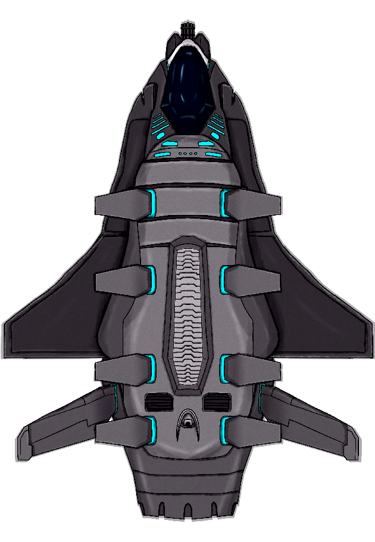

[Основные Токены](https://github.com/CatacombNoop/ktms-tokens/blob/main/images_main/README.md) |
[Основные Токены 2](https://github.com/CatacombNoop/ktms-tokens/blob/main/images_main2/README.md) |
[Мудроградовки](https://github.com/CatacombNoop/ktms-tokens/blob/main/images_mudrog/README.md) |
[Иконки](https://github.com/CatacombNoop/ktms-tokens/blob/main/images_icons/README.md) |
[Иконки Доп.](https://github.com/CatacombNoop/ktms-tokens/blob/main/images_icons2/README.md) |
[Эффекты](https://github.com/CatacombNoop/ktms-tokens/blob/main/images_sfx/README.md) |
[Токены Марка](https://github.com/CatacombNoop/ktms-tokens/blob/main/images_mark/README.md) |
[Одиум](https://github.com/CatacombNoop/ktms-tokens/blob/main/images_odium/README.md) |
[Карты](https://github.com/CatacombNoop/ktms-tokens/blob/main/images_maps/README.md) |
[**Вики**](https://github.com/CatacombNoop/ktms-tokens/wiki) |
<table><tr>
<tr>
<td valign="bottom">
 
AZR0.png
</td>

<td valign="bottom">
 
BLD0.png
</td>

<td valign="bottom">
 
BLD1.png
</td>

<td valign="bottom">
 
BLD2.png
</td>

<td valign="bottom">
 
BRA0].png
</td>

<td valign="bottom">
 
BRA1.png
</td>

</tr>
<tr>
<td valign="bottom">
 
CROC.png
</td>

<td valign="bottom">
 
FEDT0.png
</td>

<td valign="bottom">
 
FEDT1.png
</td>

<td valign="bottom">
 
FEDT2.png
</td>

<td valign="bottom">
 
FEDT3.png
</td>

<td valign="bottom">
 
GITH.png
</td>

</tr>
<tr>
<td valign="bottom">
 
ILL0.png
</td>

<td valign="bottom">
 
ILL1.png
</td>

<td valign="bottom">
 
ILL2.png
</td>

<td valign="bottom">
 
NPC0.png
</td>

<td valign="bottom">
 
NPC01.png
</td>

<td valign="bottom">
 
NPC02.png
</td>

</tr>
<tr>
<td valign="bottom">
 
NPC1.png
</td>

<td valign="bottom">
 
NPC10.png
</td>

<td valign="bottom">
 
NPC11.png
</td>

<td valign="bottom">
 
NPC12.png
</td>

<td valign="bottom">
 
NPC13.png
</td>

<td valign="bottom">
 
NPC14.png
</td>

</tr>
<tr>
<td valign="bottom">
 
NPC15.png
</td>

<td valign="bottom">
 
NPC16.png
</td>

<td valign="bottom">
 
NPC17.png
</td>

<td valign="bottom">
 
NPC18.png
</td>

<td valign="bottom">
 
NPC19.png
</td>

<td valign="bottom">
 
NPC2.png
</td>

</tr>
<tr>
<td valign="bottom">
 
NPC20.png
</td>

<td valign="bottom">
 
NPC21.png
</td>

<td valign="bottom">
 
NPC22.png
</td>

<td valign="bottom">
 
NPC23.png
</td>

<td valign="bottom">
 
NPC24.png
</td>

<td valign="bottom">
 
NPC25.png
</td>

</tr>
<tr>
<td valign="bottom">
 
NPC26.png
</td>

<td valign="bottom">
 
NPC27.png
</td>

<td valign="bottom">
 
NPC28.png
</td>

<td valign="bottom">
 
NPC282.png
</td>

<td valign="bottom">
 
NPC29.png
</td>

<td valign="bottom">
 
NPC3.png
</td>

</tr>
<tr>
<td valign="bottom">
 
NPC30.png
</td>

<td valign="bottom">
 
NPC31.png
</td>

<td valign="bottom">
 
NPC32.png
</td>

<td valign="bottom">
 
NPC33.png
</td>

<td valign="bottom">
 
NPC33_1.png
</td>

<td valign="bottom">
 
NPC34.png
</td>

</tr>
<tr>
<td valign="bottom">
 
NPC34_4.png
</td>

<td valign="bottom">
 
NPC35.png
</td>

<td valign="bottom">
 
NPC36.png
</td>

<td valign="bottom">
 
NPC36_2.png
</td>

<td valign="bottom">
 
NPC37.png
</td>

<td valign="bottom">
 
NPC38.png
</td>

</tr>
<tr>
<td valign="bottom">
 
NPC39.png
</td>

<td valign="bottom">
 
NPC4.png
</td>

<td valign="bottom">
 
NPC40.png
</td>

<td valign="bottom">
 
NPC41.png
</td>

<td valign="bottom">
 
NPC42.png
</td>

<td valign="bottom">
 
NPC43.png
</td>

</tr>
<tr>
<td valign="bottom">
 
NPC44.png
</td>

<td valign="bottom">
 
NPC5.png
</td>

<td valign="bottom">
 
NPC6.png
</td>

<td valign="bottom">
 
NPC7.png
</td>

<td valign="bottom">
 
NPC8.png
</td>

<td valign="bottom">
 
NPC9.png
</td>

</tr>
<tr>
<td valign="bottom">
 
PAS0.png
</td>

<td valign="bottom">
 
planer.png
</td>

<td valign="bottom">
 
planer2.png
</td>

<td valign="bottom">
 
planer3.png
</td>

<td valign="bottom">
 
PLN0.png
</td>

<td valign="bottom">
 
PLN1.png
</td>

</tr>
<tr>
<td valign="bottom">
 
PLN12.png
</td>

<td valign="bottom">
 
PLN122.png
</td>

<td valign="bottom">
 
PLN2.png
</td>

<td valign="bottom">
 
PLN2_0.png
</td>

<td valign="bottom">
 
PLN2_2.png
</td>

<td valign="bottom">
 
PLN2_3.png
</td>

</tr>
<tr>
<td valign="bottom">
 
PLN2_4.png
</td>

<td valign="bottom">
 
PLN3.png
</td>

<td valign="bottom">
 
PLN32.png
</td>

<td valign="bottom">
 
PLN4.png
</td>

<td valign="bottom">
 
PLN5.png
</td>

<td valign="bottom">
 
PLN6.png
</td>

</tr>
<tr>
<td valign="bottom">
 
RND0.png
</td>

<td valign="bottom">
 
RND1.png
</td>

<td valign="bottom">
 
RND2.png
</td>

<td valign="bottom">
 
RND3.png
</td>

<td valign="bottom">
 
Solditer.png
</td>

<td valign="bottom">
 
Solditer1.png
</td>

</tr>
<tr>
<td valign="bottom">
 
Solditer2.png
</td>

<td valign="bottom">
 
Solditer3.png
</td>

<td valign="bottom">
 
YAG0.png
</td>

<td valign="bottom">
 
YAG1.png
</td>

<td valign="bottom">
 
КФЕ2.png
</td>

</tr></table>