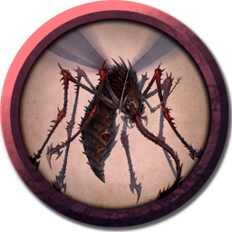

[Основные Токены](https://github.com/CatacombNoop/ktms-tokens/blob/main/images_main/README.md) |
[Основные Токены 2](https://github.com/CatacombNoop/ktms-tokens/blob/main/images_main2/README.md) |
[Мудроградовки](https://github.com/CatacombNoop/ktms-tokens/blob/main/images_mudrog/README.md) |
[Иконки](https://github.com/CatacombNoop/ktms-tokens/blob/main/images_icons/README.md) |
[Иконки Доп.](https://github.com/CatacombNoop/ktms-tokens/blob/main/images_icons2/README.md) |
[Эффекты](https://github.com/CatacombNoop/ktms-tokens/blob/main/images_sfx/README.md) |
[Токены Марка](https://github.com/CatacombNoop/ktms-tokens/blob/main/images_mark/README.md) |
[Одиум](https://github.com/CatacombNoop/ktms-tokens/blob/main/images_odium/README.md) |
[Карты](https://github.com/CatacombNoop/ktms-tokens/blob/main/images_maps/README.md) |
[**Вики**](https://github.com/CatacombNoop/ktms-tokens/wiki) |
<table><tr>
<tr>
<td valign="bottom">
 
BND0.png
</td>

<td valign="bottom">
 
BND1.png
</td>

<td valign="bottom">
 
BND2.png
</td>

<td valign="bottom">
 
BOW0.png
</td>

<td valign="bottom">
 
BOW1.png
</td>

<td valign="bottom">
 
BOW2.png
</td>

</tr>
<tr>
<td valign="bottom">
 
dedd.png
</td>

<td valign="bottom">
 
forest.png
</td>

<td valign="bottom">
 
Goblin0.png
</td>

<td valign="bottom">
 
Goblin1.png
</td>

<td valign="bottom">
 
Goblin2.png
</td>

<td valign="bottom">
 
Goblin3.png
</td>

</tr>
<tr>
<td valign="bottom">
 
Goblin4.png
</td>

<td valign="bottom">
 
KNG0.png
</td>

<td valign="bottom">
 
KNG1.png
</td>

<td valign="bottom">
 
KNG2.png
</td>

<td valign="bottom">
 
MAD0.png
</td>

<td valign="bottom">
 
MAD1.png
</td>

</tr>
<tr>
<td valign="bottom">
 
MAD2.png
</td>

<td valign="bottom">
 
Map.png
</td>

<td valign="bottom">
 
MRC1.sai2
</td>

<td valign="bottom">
 
MS0.png
</td>

<td valign="bottom">
 
MS1.png
</td>

<td valign="bottom">
 
MS2.png
</td>

</tr>
<tr>
<td valign="bottom">
 
MS3.png
</td>

<td valign="bottom">
 
NB0.png
</td>

<td valign="bottom">
 
NB1.png
</td>

<td valign="bottom">
 
NB2.png
</td>

<td valign="bottom">
 
NB3.png
</td>

<td valign="bottom">
 
NB4.png
</td>

</tr>
<tr>
<td valign="bottom">
 
NB5.png
</td>

<td valign="bottom">
 
NB6.png
</td>

<td valign="bottom">
 
NB7.png
</td>

<td valign="bottom">
 
orc.png
</td>

<td valign="bottom">
 
ORC0_1.png
</td>

<td valign="bottom">
 
ORC0_2.png
</td>

</tr>
<tr>
<td valign="bottom">
 
ork0.png
</td>

<td valign="bottom">
 
ork1.png
</td>

<td valign="bottom">
 
ork2.png
</td>

<td valign="bottom">
 
ork3.png
</td>

<td valign="bottom">
 
ork4.png
</td>

<td valign="bottom">
 
ork6.png
</td>

</tr>
<tr>
<td valign="bottom">
 
ork7.png
</td>

<td valign="bottom">
 
ork8.png
</td>

<td valign="bottom">
 
ork9.png
</td>

<td valign="bottom">
 
PL0.png
</td>

<td valign="bottom">
 
PL0_1.png
</td>

<td valign="bottom">
 
PL1.png
</td>

</tr>
<tr>
<td valign="bottom">
 
PL2.png
</td>

<td valign="bottom">
 
PS0.png
</td>

<td valign="bottom">
 
SHL1.png
</td>

<td valign="bottom">
 
SHL2.png
</td>

<td valign="bottom">
 
SLD0.png
</td>

<td valign="bottom">
 
SLD1.png
</td>

</tr>
<tr>
<td valign="bottom">
 
SLD10.png
</td>

<td valign="bottom">
 
SLD2.png
</td>

<td valign="bottom">
 
SLD3.png
</td>

<td valign="bottom">
 
SLD4.png
</td>

<td valign="bottom">
 
SLD5.png
</td>

<td valign="bottom">
 
SLD6.png
</td>

</tr>
<tr>
<td valign="bottom">
 
SLD7.png
</td>

<td valign="bottom">
 
SLD8.png
</td>

<td valign="bottom">
 
SLD9.png
</td>

<td valign="bottom">
 
SPEAR0.png
</td>

<td valign="bottom">
 
SPEAR1.png
</td>

<td valign="bottom">
 
SPEAR2.png
</td>

</tr>
<tr>
<td valign="bottom">
 
Troll.png
</td>

</tr></table>