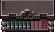
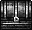
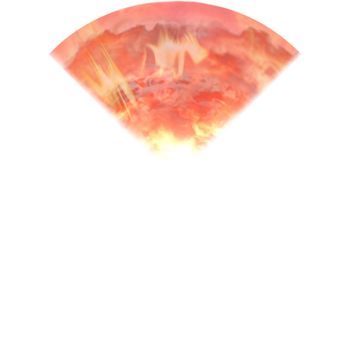

[Основные Токены](https://github.com/CatacombNoop/ktms-tokens/blob/main/images_main/README.md) |
[Основные Токены 2](https://github.com/CatacombNoop/ktms-tokens/blob/main/images_main2/README.md) |
[Мудроградовки](https://github.com/CatacombNoop/ktms-tokens/blob/main/images_mudrog/README.md) |
[Иконки](https://github.com/CatacombNoop/ktms-tokens/blob/main/images_icons/README.md) |
[Иконки Доп.](https://github.com/CatacombNoop/ktms-tokens/blob/main/images_icons2/README.md) |
[Эффекты](https://github.com/CatacombNoop/ktms-tokens/blob/main/images_sfx/README.md) |
[Токены Марка](https://github.com/CatacombNoop/ktms-tokens/blob/main/images_mark/README.md) |
[Одиум](https://github.com/CatacombNoop/ktms-tokens/blob/main/images_odium/README.md) |
[Карты](https://github.com/CatacombNoop/ktms-tokens/blob/main/images_maps/README.md) |
[**Вики**](https://github.com/CatacombNoop/ktms-tokens/wiki) |
<table><tr>
<tr>
<td valign="bottom">
 
beam.png
</td>

<td valign="bottom">
 
beam2.png
</td>

<td valign="bottom">
 
beam3.png
</td>

<td valign="bottom">
 
beam4.png
</td>

<td valign="bottom">
 
bed.png
</td>

<td valign="bottom">
 
BLOODSHED.png
</td>

</tr>
<tr>
<td valign="bottom">
 
BloodSlash.png
</td>

<td valign="bottom">
 
books.png
</td>

<td valign="bottom">
 
Chest.png
</td>

<td valign="bottom">
 
Chest3.png
</td>

<td valign="bottom">
 
chesy2.png
</td>

<td valign="bottom">
 
circ.png
</td>

</tr>
<tr>
<td valign="bottom">
 
cloud.png
</td>

<td valign="bottom">
 
Cone_Shot.png
</td>

<td valign="bottom">
 
CR.png
</td>

<td valign="bottom">
 
CR0.png
</td>

<td valign="bottom">
 
CR0_Cone.png
</td>

<td valign="bottom">
 
CR1.png
</td>

</tr>
<tr>
<td valign="bottom">
 
CR2.png
</td>

<td valign="bottom">
 
Cut.png
</td>

<td valign="bottom">
 
Darkness_spell.png
</td>

<td valign="bottom">
 
DeathCircle.png
</td>

<td valign="bottom">
 
DeathCircle2.png
</td>

<td valign="bottom">
 
DeathCircle2B.png
</td>

</tr>
<tr>
<td valign="bottom">
 
DeathCircle3.png
</td>

<td valign="bottom">
 
DivineWeapon.png
</td>

<td valign="bottom">
 
DivineWeapon2.png
</td>

<td valign="bottom">
 
Electro.png
</td>

<td valign="bottom">
 
Electro_Cone.png
</td>

<td valign="bottom">
 
Fireball.png
</td>

</tr>
<tr>
<td valign="bottom">
 
Fireball2.png
</td>

<td valign="bottom">
 
Fireball_Cone.png
</td>

<td valign="bottom">
 
Fire_hell.png
</td>

<td valign="bottom">
 
ForceCircle.png
</td>

<td valign="bottom">
 
FrostHit.png
</td>

<td valign="bottom">
 
Golden sword.png
</td>

</tr>
<tr>
<td valign="bottom">
 
Golden sword222.png
</td>

<td valign="bottom">
 
Graav.png
</td>

<td valign="bottom">
 
Graav2.png
</td>

<td valign="bottom">
 
GreenFire.png
</td>

<td valign="bottom">
 
HolyCircle.png
</td>

<td valign="bottom">
 
lamp.png
</td>

</tr>
<tr>
<td valign="bottom">
 
MindSlash.png
</td>

<td valign="bottom">
 
MindSlash_Cone.png
</td>

<td valign="bottom">
 
point.png
</td>

<td valign="bottom">
 
POINT3.png
</td>

<td valign="bottom">
 
Secret.png
</td>

<td valign="bottom">
 
SG_Ballista (2x2).png
</td>

</tr>
<tr>
<td valign="bottom">
 
SG_Ballista, great (5x3).png
</td>

<td valign="bottom">
 
SG_Cannon (3x3).png
</td>

<td valign="bottom">
 
SG_Cannon, great (3x4).png
</td>

<td valign="bottom">
 
SG_Cannon, swivel (3x3).png
</td>

<td valign="bottom">
 
SG_Catapult (3x3).png
</td>

<td valign="bottom">
 
SG_Catapult, great (4x4).png
</td>

</tr>
<tr>
<td valign="bottom">
 
SG_Siege Ladder (1x6).png
</td>

<td valign="bottom">
 
SG_Siege Ladder, raised (1x2).png
</td>

<td valign="bottom">
 
SG_Siege Ram (3x4).png
</td>

<td valign="bottom">
 
SG_Siege Tower (4x4).png
</td>

<td valign="bottom">
 
SG_Siege Tower, bridge (4x3).png
</td>

<td valign="bottom">
 
SG_Trebuchet (3x4).png
</td>

</tr>
<tr>
<td valign="bottom">
 
Shot_M.png
</td>

<td valign="bottom">
 
Shot_M2.png
</td>

<td valign="bottom">
 
Shot_M22.png
</td>

<td valign="bottom">
 
Sky_fire.png
</td>

<td valign="bottom">
 
Smoke.png
</td>

<td valign="bottom">
 
Space.png
</td>

</tr>
<tr>
<td valign="bottom">
 
Space2.png
</td>

<td valign="bottom">
 
Space3.png
</td>

<td valign="bottom">
 
Space3_2.png
</td>

<td valign="bottom">
 
Space3_3.png
</td>

<td valign="bottom">
 
Space_ER.png
</td>

<td valign="bottom">
 
Space_ER1.png
</td>

</tr>
<tr>
<td valign="bottom">
 
Space_ER1_t.png
</td>

<td valign="bottom">
 
Space_ER_t.png
</td>

<td valign="bottom">
 
Space_KP.png
</td>

<td valign="bottom">
 
Space_KP_t.png
</td>

<td valign="bottom">
 
Spark_Explosion.png
</td>

<td valign="bottom">
 
Spark_Explosion2.png
</td>

</tr>
<tr>
<td valign="bottom">
 
Stair_DW.png
</td>

<td valign="bottom">
 
Stair_UP.png
</td>

<td valign="bottom">
 
table.png
</td>

<td valign="bottom">
 
TENT.png
</td>

<td valign="bottom">
 
tile_circle.png
</td>

<td valign="bottom">
 
tile_cube.png
</td>

</tr>
<tr>
<td valign="bottom">
 
WATER.png
</td>

<td valign="bottom">
 
WaterHit.png
</td>

<td valign="bottom">
 
WindHit.png
</td>

<td valign="bottom">
 
__MAP_Snow0.jpg
</td>

<td valign="bottom">
 
ЫShine.png
</td>

</tr></table>