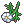
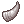
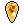
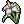
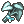
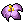
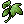
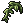
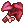
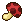

[Основные Токены](https://github.com/CatacombNoop/ktms-tokens/blob/main/images_main/README.md) |
[Мудроградовки](https://github.com/CatacombNoop/ktms-tokens/blob/main/images_mudrog/README.md) |
[Иконки](https://github.com/CatacombNoop/ktms-tokens/blob/main/images_icons/README.md) |
[Иконки Доп.](https://github.com/CatacombNoop/ktms-tokens/blob/main/images_icons2/README.md) |
[Эффекты](https://github.com/CatacombNoop/ktms-tokens/blob/main/images_sfx/README.md) |
[Токены Марка](https://github.com/CatacombNoop/ktms-tokens/blob/main/images_mark/README.md) |
[Одиум](https://github.com/CatacombNoop/ktms-tokens/blob/main/images_odium/README.md) |
<table><tr>
<tr>
<td valign="bottom">
 
F0.png
</td>

<td valign="bottom">
 
F1.png
</td>

<td valign="bottom">
 
F10.png
</td>

<td valign="bottom">
 
F11.png
</td>

<td valign="bottom">
 
F12.png
</td>

<td valign="bottom">
 
F13.png
</td>

</tr>
<tr>
<td valign="bottom">
 
F14.png
</td>

<td valign="bottom">
 
F15.png
</td>

<td valign="bottom">
 
F2.png
</td>

<td valign="bottom">
 
F3.png
</td>

<td valign="bottom">
 
F4.png
</td>

<td valign="bottom">
 
F5.png
</td>

</tr>
<tr>
<td valign="bottom">
 
F6.png
</td>

<td valign="bottom">
 
F7.png
</td>

<td valign="bottom">
 
F8.png
</td>

<td valign="bottom">
 
F9.png
</td>

</tr></table>