[Основные Токены](https://github.com/CatacombNoop/ktms-tokens/blob/main/images_main/README.md) |
[Основные Токены 2](https://github.com/CatacombNoop/ktms-tokens/blob/main/images_main2/README.md) |
[Мудроградовки](https://github.com/CatacombNoop/ktms-tokens/blob/main/images_mudrog/README.md) |
[Иконки](https://github.com/CatacombNoop/ktms-tokens/blob/main/images_icons/README.md) |
[Иконки Доп.](https://github.com/CatacombNoop/ktms-tokens/blob/main/images_icons2/README.md) |
[Эффекты](https://github.com/CatacombNoop/ktms-tokens/blob/main/images_sfx/README.md) |
[Токены Марка](https://github.com/CatacombNoop/ktms-tokens/blob/main/images_mark/README.md) |
[Одиум](https://github.com/CatacombNoop/ktms-tokens/blob/main/images_odium/README.md) |
[Карты](https://github.com/CatacombNoop/ktms-tokens/blob/main/images_maps/README.md) |
[**Вики**](https://github.com/CatacombNoop/ktms-tokens/wiki) |
<table><tr>
<tr>
<td valign="bottom">
 
21323123123123123.png
</td>

<td valign="bottom">
 
ABYSS_0.png
</td>

<td valign="bottom">
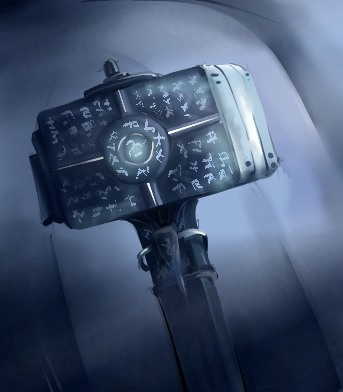 
AdamantHammer.png
</td>

<td valign="bottom">
 
AST.png
</td>

<td valign="bottom">
 
AST0.png
</td>

<td valign="bottom">
 
AST0_1.png
</td>

</tr>
<tr>
<td valign="bottom">
 
AST0_2.png
</td>

<td valign="bottom">
 
AST1.png
</td>

<td valign="bottom">
 
AST10.png
</td>

<td valign="bottom">
 
AST11.png
</td>

<td valign="bottom">
 
AST2.png
</td>

<td valign="bottom">
 
AST2_2.png
</td>

</tr>
<tr>
<td valign="bottom">
 
AST3.png
</td>

<td valign="bottom">
 
AST4.png
</td>

<td valign="bottom">
 
AST5.png
</td>

<td valign="bottom">
 
AST6.png
</td>

<td valign="bottom">
 
AST7.png
</td>

<td valign="bottom">
 
AST8.png
</td>

</tr>
<tr>
<td valign="bottom">
 
AST9.png
</td>

<td valign="bottom">
 
Astral0.jpg
</td>

<td valign="bottom">
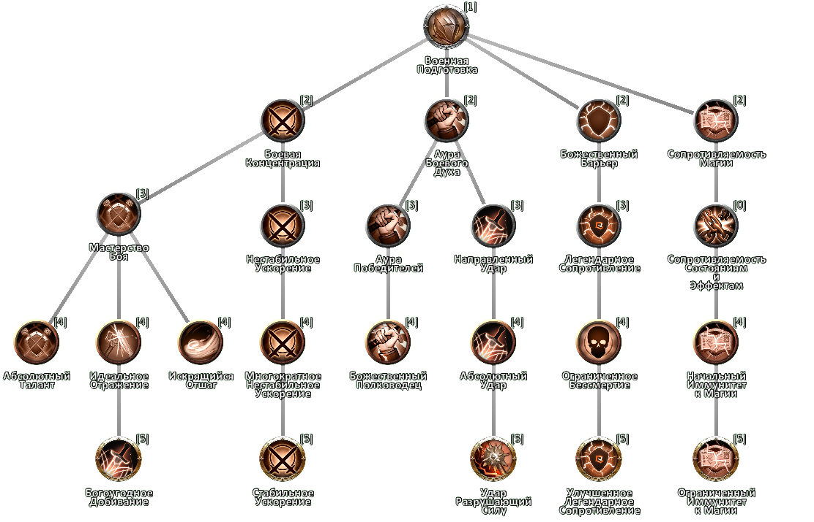 
Domain-of-Battle.png
</td>

<td valign="bottom">
 
EMPTY.png
</td>

<td valign="bottom">
 
Erynthul.jpg
</td>

<td valign="bottom">
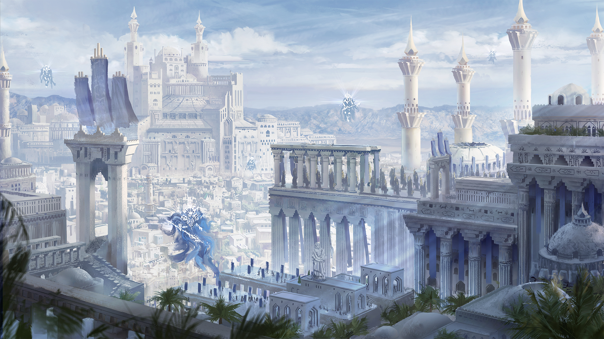 
estel-city.png
</td>

</tr>
<tr>
<td valign="bottom">
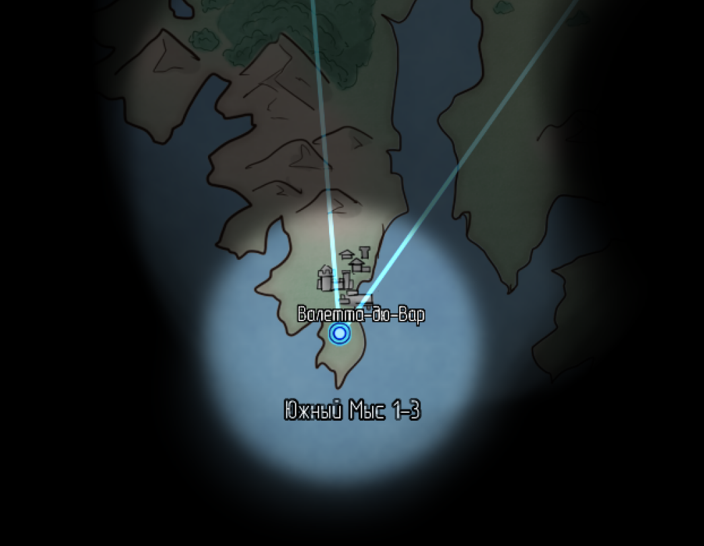 
estel-city0.png
</td>

<td valign="bottom">
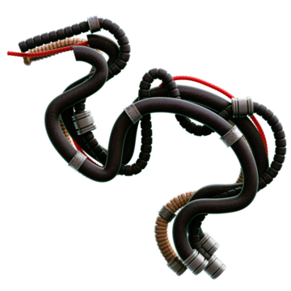 
EST_0.png
</td>

<td valign="bottom">
 
EST_1.png
</td>

<td valign="bottom">
 
EST_2.png
</td>

<td valign="bottom">
 
EST_3.png
</td>

<td valign="bottom">
 
EST_4.png
</td>

</tr>
<tr>
<td valign="bottom">
 
F0.png
</td>

<td valign="bottom">
 
F1.png
</td>

<td valign="bottom">
 
F10.png
</td>

<td valign="bottom">
 
F11.png
</td>

<td valign="bottom">
 
F12.png
</td>

<td valign="bottom">
 
F13.png
</td>

</tr>
<tr>
<td valign="bottom">
 
F14.png
</td>

<td valign="bottom">
 
F15.png
</td>

<td valign="bottom">
 
F16.png
</td>

<td valign="bottom">
 
F17.png
</td>

<td valign="bottom">
 
F18.png
</td>

<td valign="bottom">
 
F19.png
</td>

</tr>
<tr>
<td valign="bottom">
 
F2.png
</td>

<td valign="bottom">
 
F20.png
</td>

<td valign="bottom">
 
F21.png
</td>

<td valign="bottom">
 
F22.png
</td>

<td valign="bottom">
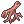 
F23.png
</td>

<td valign="bottom">
 
F24.png
</td>

</tr>
<tr>
<td valign="bottom">
 
F25.png
</td>

<td valign="bottom">
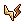 
F26.png
</td>

<td valign="bottom">
 
F27.png
</td>

<td valign="bottom">
 
F28.png
</td>

<td valign="bottom">
 
F29.png
</td>

<td valign="bottom">
 
F3.png
</td>

</tr>
<tr>
<td valign="bottom">
 
F30.png
</td>

<td valign="bottom">
 
F31.png
</td>

<td valign="bottom">
 
F32.png
</td>

<td valign="bottom">
 
F4.png
</td>

<td valign="bottom">
 
F5.png
</td>

<td valign="bottom">
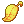 
F6.png
</td>

</tr>
<tr>
<td valign="bottom">
 
F7.png
</td>

<td valign="bottom">
 
F8.png
</td>

<td valign="bottom">
 
F9.png
</td>

<td valign="bottom">
 
gmod_addon_stuff.png
</td>

<td valign="bottom">
 
ISLAND_MAP.png
</td>

<td valign="bottom">
 
MagicGun.png
</td>

</tr>
<tr>
<td valign="bottom">
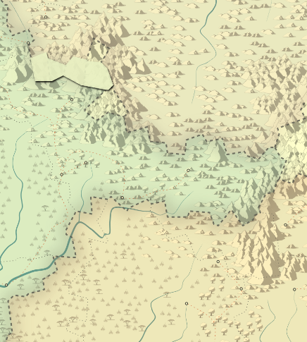 
Malarw.png
</td>

<td valign="bottom">
 
Skill_Check_DC_0.png
</td>

<td valign="bottom">
 
Skill_Check_DC_1.png
</td>

<td valign="bottom">
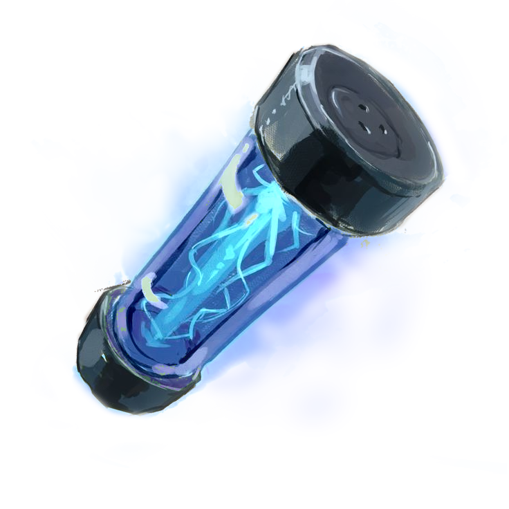 
Spark_Container.png
</td>

<td valign="bottom">
 
STYX.png
</td>

<td valign="bottom">
 
STYX2.png
</td>

</tr>
<tr>
<td valign="bottom">
 
STYX3.png
</td>

<td valign="bottom">
 
SWORDD.png
</td>

<td valign="bottom">
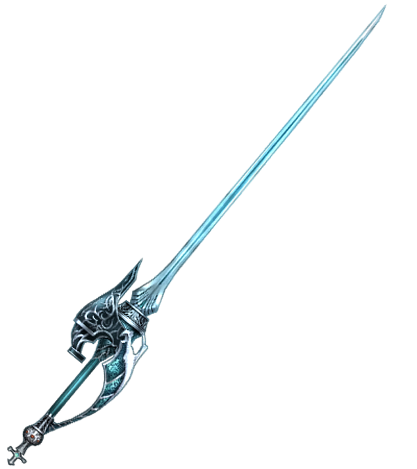 
SWORDD2.png
</td>

<td valign="bottom">
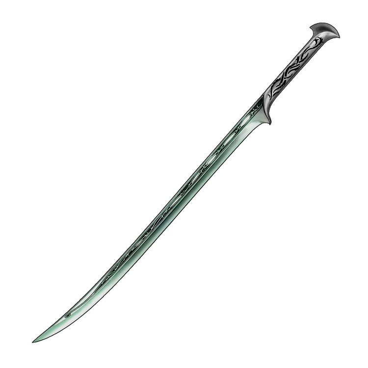 
SWORDD3.png
</td>

<td valign="bottom">
 
SWORDD4.png
</td>

<td valign="bottom">
 
Vilia 2023-06-14-10-56.png
</td>

</tr>
<tr>
<td valign="bottom">
 
WISE_SHRINE.png
</td>

<td valign="bottom">
 
WMAP.jpg
</td>

<td valign="bottom">
 
WMAP_CUT
</td>

<td valign="bottom">
 
ZLATO.png
</td>

</tr></table>