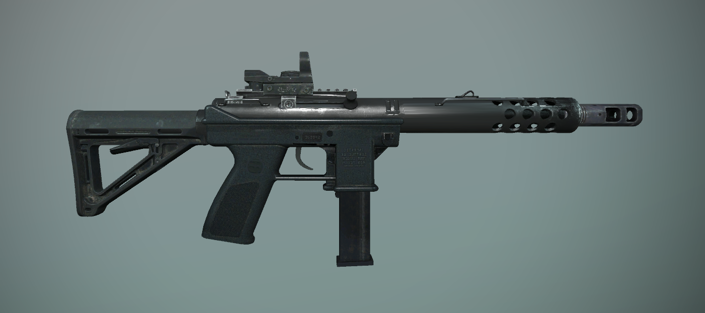
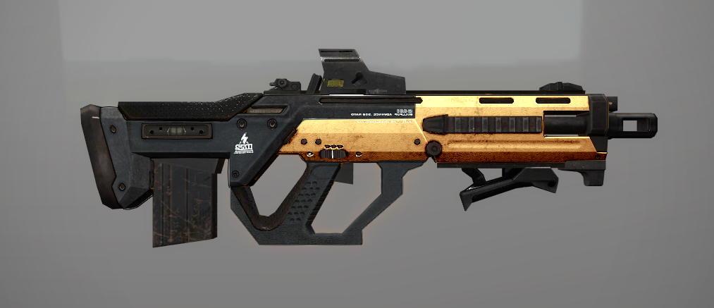
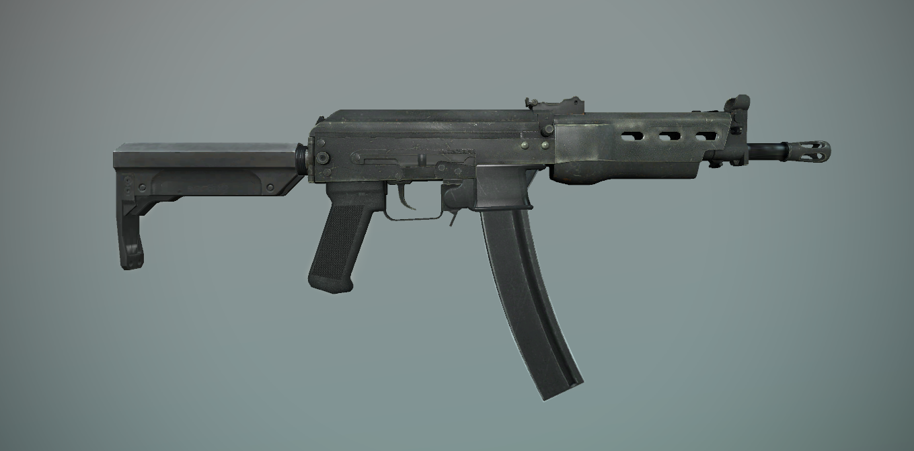
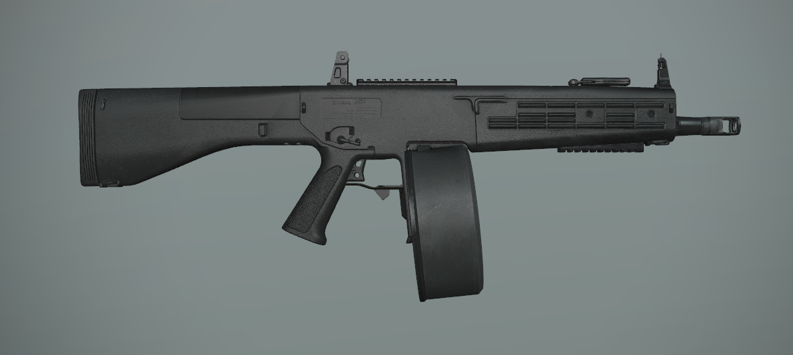

[Основные Токены](https://github.com/CatacombNoop/ktms-tokens/blob/main/images_main/README.md) |
[Основные Токены 2](https://github.com/CatacombNoop/ktms-tokens/blob/main/images_main2/README.md) |
[Мудроградовки](https://github.com/CatacombNoop/ktms-tokens/blob/main/images_mudrog/README.md) |
[Иконки](https://github.com/CatacombNoop/ktms-tokens/blob/main/images_icons/README.md) |
[Иконки Доп.](https://github.com/CatacombNoop/ktms-tokens/blob/main/images_icons2/README.md) |
[Эффекты](https://github.com/CatacombNoop/ktms-tokens/blob/main/images_sfx/README.md) |
[Токены Марка](https://github.com/CatacombNoop/ktms-tokens/blob/main/images_mark/README.md) |
[Одиум](https://github.com/CatacombNoop/ktms-tokens/blob/main/images_odium/README.md) |
[Карты](https://github.com/CatacombNoop/ktms-tokens/blob/main/images_maps/README.md) |
[**Вики**](https://github.com/CatacombNoop/ktms-tokens/wiki) |
<table><tr>
<tr>
<td valign="bottom">
 
AB24.png
</td>

<td valign="bottom">
 
ABU24.png
</td>

<td valign="bottom">
 
BOLT.png
</td>

<td valign="bottom">
 
DVS.png
</td>

<td valign="bottom">
 
FLAME.png
</td>

<td valign="bottom">
 
GRND.png
</td>

</tr>
<tr>
<td valign="bottom">
 
GRND2.png
</td>

<td valign="bottom">
 
GRND3.png
</td>

<td valign="bottom">
 
IRB.png
</td>

<td valign="bottom">
 
KST_AS.png
</td>

<td valign="bottom">
 
KST_AS2.png
</td>

<td valign="bottom">
 
KST_AS3.png
</td>

</tr>
<tr>
<td valign="bottom">
 
KST_AS4.png
</td>

<td valign="bottom">
 
LAZ_PIST.png
</td>

<td valign="bottom">
 
LAZ_RIFL.png
</td>

<td valign="bottom">
 
LAZ_RIFL2.png
</td>

<td valign="bottom">
 
MG_BS.png
</td>

<td valign="bottom">
 
MG_BS1.png
</td>

</tr>
<tr>
<td valign="bottom">
 
MG_BS2.png
</td>

<td valign="bottom">
 
MG_MIN.png
</td>

<td valign="bottom">
 
MOD0.png
</td>

<td valign="bottom">
 
OSH_R.png
</td>

<td valign="bottom">
 
PB.png
</td>

<td valign="bottom">
 
PE.png
</td>

</tr>
<tr>
<td valign="bottom">
 
PIST.png
</td>

<td valign="bottom">
 
PPBS.png
</td>

<td valign="bottom">
 
PPBS2.png
</td>

<td valign="bottom">
 
R16.png
</td>

<td valign="bottom">
 
RPG.png
</td>

<td valign="bottom">
 
SBORN_REV.png
</td>

</tr>
<tr>
<td valign="bottom">
 
SBORN_REV2.png
</td>

<td valign="bottom">
 
SBORN_REV3.png
</td>

<td valign="bottom">
 
SBORN_SHT.png
</td>

<td valign="bottom">
 
SHT_G.png
</td>

<td valign="bottom">
 
SHT_G2.png
</td>

<td valign="bottom">
 
SHT_G3.png
</td>

</tr>
<tr>
<td valign="bottom">
 
SHT_G4.png
</td>

<td valign="bottom">
 
SMG_BR.png
</td>

<td valign="bottom">
 
SNPBRZ.png
</td>

<td valign="bottom">
 
STATION_MG.png
</td>

<td valign="bottom">
 
STATION_RF.png
</td>

<td valign="bottom">
 
SVMD.png
</td>

</tr>
<tr>
<td valign="bottom">
 
TECH_MGN.png
</td>

<td valign="bottom">
 
TECH_UNK.png
</td>

</tr></table>